

<table>
<tr style="display: none">
	<td style="width: 70%"></td>
	<td style="width: 30%"></td>
</tr>
<tr>
	<td colspan="2">
		<a name="intro"><h1>Introduction</h1></a>
		

			This is a report of a NetHack adventure that I origially wrote for
			<a href="http://www.battlereports.com/viewreports.php?reportnum=6190">battlereports.com</a> in the early 2000's.
			The original concept has been to write a short report based on "one quick game" to help
			a friend of mine who was launching a new site. As you will see, things got away from me...
			  
			NetHack is freely distributable,
			open-source game that has been continuously developed for longer than most people reading
			this have been alive.  The <i>Net</i> in NetHack refers to the distributed nature of the
			development team.  The <i>hack</i> refers to the old roguelike game Hack upon which NetHack
			was originally based.  For more information visit the
			<a href="http://nethack.org" target="_blank">official NetHack website</a>.
		

		

			A lot of the gameplay mechanics of NetHack are based on the early <a href="http://www.wizards.com">
			Advanced Dungeons & Dragons</a> rules.  Many creatures are based on those found in both D&D and
			the <a href="http://www.lordoftherings.net/">Tolkien mythos</a>.  Being familiar with either or both
			will not necessarily help you play the game, but it may make you more familiar with certain elements.
		

	</td>
</tr>
<tr>
	<td colspan="2">
</td>
</tr>
<tr>
	<td>
		<a name="toc"><h1>Table of Contents</h1></a>
		<li><a href="#genesis">Genesis</a></li>
		<li><a href="#dungeonsofdoom">The Dungeons of Doom</a></li>
		<li><a href="#deeper">Deeper into the Dungeon</a></li>
		<li><a href="#mines">The Gnomish Mines</a></li>
		<li><a href="#sokoban">Sokoban and The Oracle</a></li>
		<li><a href="#plea">A Plea for Help</a></li>
		<li><a href="#business">Unfinished Business</a></li>
		<li><a href="#quest">The Quest</a></li>
		<li><a href="#medusa">Medusa and Beyond</a></li>
		<li><a href="#gehennom">Gehennom</a></li>
		<li><a href="#amulet">The Amulet of Yendor</a></li>
		<li><a href="#escape">The Great Escape</a></li>
	</td>
	<td>
		<!--
		

			

				Table of Contents information
			

		

		-->
	</td>
</tr>
<tr>
	<td colspan="2">
</td>
</tr>
<tr>
	<td>
		<a name="genesis"><h1>Genesis</h1></a>
		
From the void booms a voice...

		

			Who are you?
			Artius
		

		

			What are you?
			A Chaotic Male Elven Wizard
		

		
...And so begins my adventure.

	</td>
	<td>
		

			When you start a new game of NetHack, you can pick your sex, race, role and alignment.
			Not all combinations are possible, but for the most part you can be anything you want.
			  
			New players should probably start as a Neutral Female Human Valkyrie.  For reasons too complex
			to get into here, they are the easiest character to play.
		

	</td>
</tr>
<tr>
	<td>
		

			It is written in the Book of Anhur: 
			 
			&nbsp;&nbsp;After the Creation, the cruel god Moloch rebelled 
			&nbsp;&nbsp;against the authority of Marduk the Creator. 
			&nbsp;&nbsp;Moloch stole from Marduk the most powerful of all 
			&nbsp;&nbsp;the artifacts of the gods, the Amulet of Yendor, 
			&nbsp;&nbsp;and he hid it in the dark cavities of Gehennom, the 
			&nbsp;&nbsp;Under World, where he now lurks, and bides his time.
			  
			Your god Anhur seeks to possess the Amulet, and with it
			to gain deserved ascendance over the other gods.
			  
			You, a newly trained Evoker, have been heralded
			from birth as the instrument of Anhur.  You are destined
			to recover the Amulet for your deity, or die in the
			attempt.  Your hour of destiny has come.  For the sake
			of us all:  Go bravely with Anhur!
		

	</td>
	<td>
		

			Every game has the same core quest.  Recover the Amulet of Yendor and offer it to your God.
			The names might change from game to game (they depend on your character role and
			alignment) but it's always the same quest.
			  
			Some people have played NetHack for years and
			never laid hands on the Amulet, let alone survive long enough to hand it over to your
			chosen deity.
		

	</td>
</tr>
<tr>
	<td>
		

			Hello Artius, welcome to NetHack! 
			You are a chaotic male elven Wizard.
		

		

			Yes.  Yes I am, thank you very much.  Not much of a Wizard though.  You see, although I've
			been training my entire life for this very moment, I am Wizard of meager capacity, knowing
			only a few minor spells and armed with what few items my village could spare.
		

		

			At my side is my pet cat Oscar who has faithfully followed me into the dungeon.  It's amazing
			how if you feed an animal enough, it will follow you anywhere.  I remember finding Oscar as a
			kitten, foraging for scraps near our trash heap.  We've always done everything together since
			that day.  It takes a great effort, but I force images of my past from my mind in order to better focus
			on my new surroundings.
		

		

			Oscar has risked much in joining me on this venture into the dungeon, and I reward him with an
			impressive title.
		

		What do you want to call the kitten:
		Oscar the Brave
		

			I feel pangs of regret as I bestow the title though.  I fear that whatever fate awaits me, Oscar's
			has already been sealed.  I vow to protect him with the same vigor I know he will
			show in defending me but in all likelihood he will not survive the journey.
			"Oscar, you and me...  We gotta stick together down here," I whisper as I scratch his belly.
		

	</td>
	<td>
		

			NetHack is a semi-random game in that a lot of the levels and events
			in the game are randomly generated.  At the same time, other aspects of the game remain the same
			from session to session.  Throughout this battle report, information will be revealed about my
			adventure that might <i>spoil</i> the game for other players.
			  
			It is impossible to remove all <i>spoilers</i> from a report such as this, however, the most serious
			spoilers will be called out separately from general information boxes such as this one.  If you wish
			you can hide all of those spoilers by clicking this button right now.
			  
			

				<input id="hideSpoilers" type="button" onclick="hideSpoilers()" value="Hide Spoilers" />
				<input id="showSpoilers" style="display: none" type="button" onclick="showSpoilers()" value="Show Spoilers" />
			

		

	</td>
</tr>
<tr>
	<td>
		

			I cannot give Oscar direct orders, but I can influence his behavior in a number of ways.
			Oscar will fight by my side, but of his own volition.  If he gets hungry, scared or injured,
			he might run away.  Over time, if he survives, he will grow in power as I do.
		

		

			Oscar seems to sense the danger and looks to me, as though asking "Are you ready for this?"
			"Don't worry Oscar, I got it covered."  I'm bright and good with my hands, which are pretty important
			attributes to have as a Wizard.  Otherwise I'm fairly average.  I'm fully healed and surging with
			magical energy.  I've never seen combat before, so I can't say how well I'm prepared.  The hairs on the
			back of my neck tell me that I'll know soon enough.
		

	</td>
	<td>
		

			(Here is a minor spoiler to serve as an example)  
			You always start with a pet, either a cat, dog or horse.  Certain classes have a fixed pet type,
			to start with , for example. Wizards will always start with a cat, while Knights always start
			with a horse.
		

	</td>
</tr>
<tr>
	<td>
		

			Artius the Evoker St:12 Dx:16 Co:12 In:16 Wi:9 Ch:10 Chaotic 
			Dlvl:1 $:0  HP:11(11) Pw:8(8) AC:9 Exp:1 T:1
		

		

			I decide to double check the equipment I brought with me before deciding on my course of action.
		

		<table class="innertable">
		<tr>
			<td style="width:25%">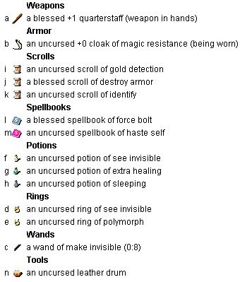</td>
			<td>
				

					I had my quarterstaff blessed by my village's priest right before I left.  It was my father's
					before me, and his father's before him.  I draw strength from its strength.
				

				

					The village elders granted me our most prized possession - a cloak of magic resistance.
					This item will protect me from a variety of dangers during my adventure, provided that I
					keep it tightly drawn at all times.  If I'm foolish or careless, it might end up wrapped
					around another.
				

				

					I managed to grab a handful of scrolls from the library before I departed.  Looking at them now,
					I'm not sure what I was thinking.  I will encounter no shortage of treasure
					during my adventure, so a scroll of gold detection doesn't seem as though it will be particularly
					useful to me.  I'm don't know why I would ever want to read a scroll of destroy armor, but
					I take comfort in the fact that I know what such a scroll looks like.  At least I won't fall
					prey to that particular incantation unexpectedly.  The last item, the scroll of identify, is
					of great value - not just to me, but to all adventurers.  With it, I can divine the nature of
					a variety of objects I might encounter.
				

			</td>
		</tr>
		</table>
	</td>
	<td>
		

			The status bar in NetHack tells you most of what you need to know about yourself.  From left to
			right, the status bar shows the following:
			<li>Name and title</li>
			<li>Strength</li>
			<li>Dexterity</li>
			<li>Constitution</li>
			<li>Intelligence</li>
			<li>Wisdom</li>
			<li>Charisma</li>
			<li>Alignment</li>
			 
			Then, on the next row is:
			<li>Dungeon Level</li>
			<li>Cash (in Zorkmids)</li>
			<li>Hit points (current/max)</li>
			<li>Power (current/max)</li>
			<li>Armor Class</li>
			<li>Experience Level</li>
			<li>Turn</li>
		

	</td>
</tr>
<tr>
	<td>
		

			My spellbooks are my most valuable items.  A scroll can be used only once, but using a spellbook, I
			can learn spells permanently and cast them as much as I like.  I've brought books of Force Bolt and
			Haste Self with me.  Force Bolt is a minor offensive enchantment, whereas Haste Self will help me if I
			feel the need to run away.  I know these spells already, but I brought the books with me, just in case
			I forget or need to refresh my memory on the finer points.  The books are fairly heavy, so I'll be on
			the lookout for a safe place to store them.  I'd like to travel as light as possible so as to have plenty
			of room to collect new treasures and items.
		

		

			Our alchemist crafted a minor selection of potions to aid me in my journey.  The potion of extra
			healing has an obvious purpose, it would be wasted if I drink it too soon though as it can heal far
			more damage than I am currently capable of surviving.  Still, I promise myself that I will not die with
			this potion still in my possession.  I shudder to think of the circumstances which would require me to
			quaff my potion of see invisible, but all things being equal, I'd rather have it than not.  It would be
			foolish for me to drink my potion of sleep in such a dangerous environment.  Still if I'm accurate enough,
			I might be able to hit an enemy with it and gain an advantage.
		

	</td>
	<td>
		

			Each class has a different pool of potential starting equipment.  The actual items you start with
			may vary from game to game, but the theme will be similar.
		

		 
		

			Wizards always start with the Blessed +1 Quarterstaff, Cloak of Magic Resistance and Spellbook
			of Force Bolt.  All other items that I started with were randomly generated.
		

	</td>
</tr>
<tr>
	<td>
		

			The rings I, uh, acquired.  Recently.  Anyway they are pretty powerful.  My ring of see invisible will
			allow me greater vision for as long as I wear it (as opposed to my potion which will only produce a temporary
			effect).  The ring of polymorph has incredible but unpredictable powers.  I've never worn one before,
			but a friend of mine got turned into a sewer rat once.  If I had some way to control it's power, I would
			be less reluctant to use it.
		

		

			Wands of make invisible are great to have for parties, and I can see how I might need it down here.  I
			look over at Oscar who is assessing his own equipment (he started with four paws and a tail) and smirk
			Normally I wouldn't want to make my pet invisible because I like to be able to see him.  With this wand
			and my ring though I could give Oscar a slight advantage without losing track of him.  Still, I don't
			know how long the effect would last, and I'm wary of making him invisible forever.  Also, wearing magic
			rings has a draining effect over time.  I consider the costs too high to commit to wearing my ring
			of see invisible throughout my adventure.
		

		

			I also brought a drum with me.  I have no idea why.  I would discard it immediately, but Oscar would just
			play with it.  I'll look for a safe place to stash it later.
		

		

			And so, with nothing left to do, I take my first steps into the Dungeon of Doom...
		

	</td>
	<td>
		

			Rings increase your digestion rate, so you become hungry faster.  I don't have a steady supply of
			food, so I would like to not have to use any rings for the time being.
		

	</td>
</tr>
<tr>
	<td colspan="2">
</td>
</tr>
<tr>
	<td>
		<a name="dungeonsofdoom"><h1>The Dungeons of Doom</h1></a>
		<table class="innertable">
		<tr>
			<td>
				
Hello Artius, welcome to NetHack!  You are a chaotic male elven Wizard.

				

					I reach the bottom of the entry stairs and enter a moderately sized chamber.  At my side is my pet cat
					Oscar who has faithfully followed me into the dungeon.  A sword lies near me, propped up against the
					opposite wall.  Passages lead North, East and West to who knows where.
				

			</td>
			<td style="width:25%">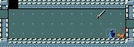</td>
		</tr>
		</table>
		

			I decide to head off to the Northwest and find that both doors there lead into the same corridor.
			I examined the longsword along the way and it looked pretty much like your standard issue blade.  I have
			no skill with blades of that length though, so I didn't even touch it.  Oscar played with the
			sword briefly before following me into the hallway.
		

		

			Following the passages to wherever they lead, I come across a closed wooden door.  It appears as though
			No one has used this door in a long time, and it sticks when I try to open it.  It takes me three or
			four good tugs to get it open.  The room is empty, so I move on.
		

	</td>
	<td>
		

			NetHack started as a character-based game that could be played over a terminal connection.  Several
			years ago the "dev team" implemented a graphical tile system that can be seen in these screenshots.
			While the graphics may seem primitive by today's standards, today's gameplay seems primitive by
			NetHack standards.
		

	</td>
</tr>
<tr>
	<td>
		<table class="innertable">
		<tr>
			<td style="width:25%">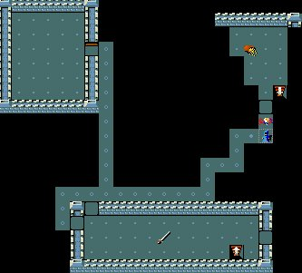</td>
			<td>
				

					Backtracking and following a different route, I come across a third large chamber.  This time
					I see some gold coins laying near a staircase downwards.  A grid bug jumps into the corridor to
					face me, and I let out a light gasp.  Oscar is several paces behind me in the hallway, but I think
					I can handle a simple grid bug on my own.  I touch the heels of my hands together and open my fingers
					out like a fan.  Driving my arms forward, I produce a force bolt.
				

				

					The grid bug is obliterated by the shockwave I produce but I have no time to celebrate my victory.
					A second grid bug turns the corner.  This time though, I lack the energy to cast my spell.  I grab
					the quarterstaff firmly with both hands and charge.  With a single strike of my staff, I kill the
					second bug and enter the room safely.
				

			</td>
		</tr>
		</table>
		

			Oscar doesn't seem upset at all that he missed the action.  He sniffs the bug bits that are left,
			then we both rest.  Once I've recovered enough power to cast force bolt again, I collect the gold and
			exit the room through a passage to the East.
		

	</td>
	<td>
		

			Grid bugs are pretty much the easiest foe you'll find in NetHack.  These two certainly didn't
			scare me, and while they went down easier than I might have expected, the outcome was never in
			doubt.
		

	</td>
</tr>
<tr>
	<td>
		

			This new passage snakes around to the south and I come across another wooden door.  This one is locked though
			and no amount of tugging will open it.  I decide to see where else this passage leads and come back to
			this door later.  A few steps further and I find myself back in the entry chamber.
		

		

			With no where else to go, I return to the locked door.  I have enough power to cast another force bolt,
			and I'm pretty sure that would knock this door right off it's hinges.  If I do that though, then I won't
			have enough energy to deal with whatever might be on the other side.  Also, my force bolt could hurt and
			anger a neutral creature or destroy some items on the other side.  I put my backpack down for a second
			and kick at the door until I break the lock.  On the fourth kick, the door splinters and I'm through.
		

	</td>
	<td>
		

			There are a variety of ways to deal with closed and locked doors in NetHack.  Sometimes it is to
			your benefit to leave a door intact so that you can close (or lock) it again.  Using force bolt or
			a strong kick will ruin a door so it cannot be used again.
		

	</td>
</tr>
<tr>
	<td>
		

			A snarling jackal has fallen into a pit in this room.  I step back and watch Oscar dispatch him with
			a series of blows.  The helpless creature has no chance and Oscar beams with pride.
		

		

			Following the network of passages and rooms, I find a pair of unrecognized scrolls that and a green gem.
			Oscar likes the gem so I let him play with it for a while.  I doubt it's valuable and I don't want to waste
			my identify scroll on something so petty.
		

		

			Later, when I stoop down to pick up a green potion, Oscar finishes playing with the green gem and drops
			it at my feet.  I notice a lichen nearby (a small mold) and I quickly smash it with my staff and eat the
			remains.  I can last quite a while without foot, but it always pays to stay on top of things.  I would
			have shared it with Oscar, but he wasn't paying attention and what he doesn't know won't hurt him.
		

	</td>
	<td>
		

			Had we not seized the advantage, the jackal would have eventually escaped the pit trap and fought
			on more equal footing.  Certainly between me and Oscar we could have handled him anyway.
		

	</td>
</tr>
<tr>
	<td>
		

			I'm feeling confident, but not nearly as confident as Oscar.  Before I can enter the next room, he dashes
			in and takes on a pair of jackals.  I want to help with a force bolt, but Oscar is standing in between
			me and the beasts.  Had I known Oscar was so ferocious, I might not have kept him as a pet all these years.
			Here though, his ferocity is an advantage and the jackals fall.
		

		<table class="innertable">
		<tr>
			<td>
				

					I handle the remaining denizens personally, dispatching a grid bug, a jackal and a goblin with a combination
					of force bolts and staff work.  I allow Oscar to consume the jackal corpse and sort through a variety
					of items I've collected so far.  None interest me so I leave them and move on.
				

				

					Following all available routes, Oscar and I keep circling back on ourselves and we realize that there's
					not much more for us to do here.  I find a fountain and a sink in separate rooms, but don't know
					what to do with either.  We head back to the staircase we found earlier and descend.  On the way
					back to the staircase, Oscar steps on a falling rock trap and is killed by the projectile.
				

			</td>
			<td style="width:25%">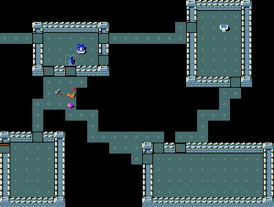</td>
		</tr>
		</table>
		

			Had he lived longer, you would have grown to love him as I loved him.  Lacking the tools for a proper burial though,
			I can do nothing more for Oscar now.  I step carefully and keep my eye on the ceiling all the way back to
			the staircase.
		

	</td>
	<td>
		

			If you <b>quaff</b> from a fountain, there is a slight chance you will be permitted to wish for an object.
			There are several other possible outcomes from drinking from a fountain though, and many of them
			are undesirable or fatal, especially for beginning characters.
		

	</td>
</tr>
<tr>
	<td>
		
Noises abound on the second level of the dungeon...

		
You hear the chime of a cash register

		
You hear the footsteps of a guard on patrol

		

			I kill a newt and instantly feel power surging through my veins.  Though still an evoker, I am now
			level two and about twice as powerful as I was before.  I feel tougher too, probably from kicking down
			so many doors.
		

		

			I collect a series of items of marginal value, but do manage to pickup an oil lantern and a food ration.
			The lantern will be invaluable as I descend deeper and find more darkness.  The food ration will keep
			quite some time, so I can save that to eat later.  Corpses will spoil so I have to eat them right away
			if I ever intend to.
		

	</td>
	<td>
		

			These sounds indicate that special rooms have been placed on this level.  The cash register means
			that there is a store somewhere and the footsteps indicate that a treasure vault is hidden.
		

	</td>
</tr>
<tr>
	<td>
		<table class="innertable">
		<tr>
			<td style="width:25%">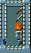</td>
			<td>
				

					I explore the level fully and find two down staircases and a small store with weapons and armor.  Sadly
					the store didn't carry anything that I was qualified to use, and they really didn't have much of a
					selection anyway.
				

				

					While trying to decide which staircase to explore, I stop at a small chest I passed earlier to see if I
					can open it.  It's locked and I decide to try to kick it open.  I take a step back to get some room to
					operate and suddenly I'm falling.
				

			</td>
		</tr>
		</table>
		

  			I hit the ground and realize I've fallen through a trapdoor down to a lower level of the dungeon.
  			I didn't fall too far though, so I suspect that I'm only one level down, on level three of the dungeon.
			I quickly find the staircase back to the second level and return to retrieve the chest.  This time I
			carry it back to near the stairs and kick it open.  In doing so, I break some of the contents.  All that
			is left inside is a slightly damp scroll, soaked in some potion that was apparently fragile or something.
		

	</td>
	<td>
		

			The two staircases indicate a branch in the dungeon.  One leads further down into the
			Dungeons of Doom, the other leads into the Gnomish Mines.  The Gnomish Mines is a great area for
			adventuring and contains some important areas, including a whole town.  The combat down
			there can get pretty dicey though.  If you're a wizard, you should usually save it for later.  If you're
			something a little tougher like a Barbarian or Valkyrie, then you can usually go straight in.
		

	</td>
</tr>
<tr>
	<td>
		

			I decide to fill the chest with items that I'm not planning to use right away.  I put my spellbooks in
			there and most of the unidentified scrolls and potions I've managed to pick up.  I keep the lantern
			because I'll probably need that wherever I go.
		

		

			<a href="level2.jpg" target="_blank">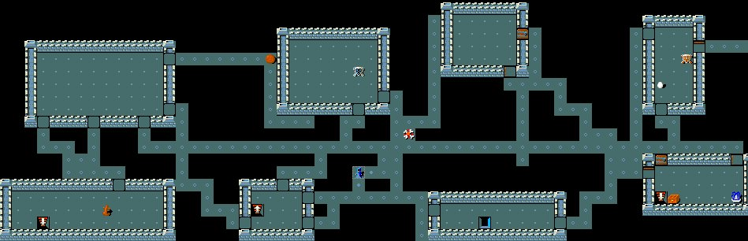</a> 
			Partial Level 2 Map (click to enlarge)
		

		

			I'm hungry, so I eat the food ration I'd found earlier.  I'm fully healed, traveling light and well-fed
			but other than that I don't have much going for me.  I haven't found any items of particular utility yet
			(other than the lamp).  I'm level 3, but I need to start complementing my level with better armor and
			hopefully new spells.  I'm glad to be alive, but I don't feel that I have a whole lot going for me just
			yet.
		

	</td>
	<td>
		

			Losing my pet was a much bigger loss than I let on.  Pets can help you determine the blessed/cursed
			status of an item.  Without Oscar to help me do this, my only (current) route to this knowledge is
			that one scroll of identify, and that won't get me very far.  This will make it tough for me to get
			the armor I need, but I have a couple of ways to work on that.
			  
			Pets are also great for new players because they never eat corpses that aren't safe to eat.  There
			are all kinds of really bad things that can happen to you from eating the wrong corpse, or any <i>
			spoiled</i> corpse for that matter.  Fortunately, I'm an experience player so I don't need my pet's
			help in that area.
		

	</td>
</tr>
<tr>
	<td colspan="2">
</td>
</tr>
<tr>
	<td>
		<a name="deeper"><h1>Deeper into the Dungeon</h1></a>
		

			I continue my descent into the Dungeons of Doom and being wandering around the third level of the
			dungeons.  I come across an unused leash and it makes me think of Oscar.  If I'd had this before, I
			might have been able to control his movements well enough to keep him away from that rock trap that
			killed him.  I notice a drop of wetness on the ground near the leash, but can't for the life of me
			figure out how it got there.
		

		

			Further along, I come across a T-shirt someone has left behind.  I put it in my backpack for later as I'm
			a T-shirt and jeans kind of guy.  I know that if I put it on now, and it's a cursed item, I won't be able
			to remove it.
		

		

			The number of creatures has been steadily increasing as I go deeper in the dungeon.  I come across a green
			gas spore which I safely dispatch with a force bolt.  Two jackals run at me in a straight line and I
			kill them both with a single force bolt.
		

	</td>
	<td>
		

			You can <b>apply</b> a leash to a pet and the pet will be forced to move with you (until the leash
			breaks or something else happens).  Note that whenever I refer to a specific command in NetHack, I'll
			use <b>bold text</b>.  Check the guidebook or in-game help for more information on specific commands.
		

		 
		

			A T-shirt is a great item for later in the game.  It can be enchanted and worn under your armor.
			Using a T-shirt, you can decrease your armor class by about 5 points without occupying another
			more common armor slot.
		

	</td>
</tr>
<tr>
	<td>
		

			I achieve level 4 as a result of all this combat and now bear the official title of Conjurer.  I feel wide
			awake as a result.  I've not been tired thus far in my adventure, so I'm not sure why I suddenly notice
			how wide awake I feel.
		

		

			Descending further to level 5 of the dungeon, I continue to mow through enemies using my force bolt spell.
			I find that most foes fall to one or two castings.  I'm able to maintain my power levels so I don't have to
			worry about running out of energy during a fight.  I'm noticing that I'm destroying more and more potions
			as I advance through the dungeon.  If I had a better weapon than force bolt, I'd gladly use it.
		

		

			More and more creatures come out of the woodwork.  A fog cloud engulfs me and I can barely breathe through
			all the moisture.  I blast my way out with a force bolt and have to quickly dispatch a hobbit, jackal and
			acid blob in short order.  I'm reminded of the benefits of force bolt as I accidentally destroy a secret door
			I wasn't even aware of.  With trepidation, I continue through the newly opened passage.
		

		

			Some of the passages are blocked by giant boulders.  I am able to move some of these by pushing with all
			of my strength, but others seem to be blocked from the other side.  If I have no other choice, I use
			force bolt to reduce the boulders to pebbles, but I prefer to save my magic for threats rather than
			inconveniences.
		

		

			I get hungry looking for the stairs down and finish a food ration I had been nibbling on.  Something
			must have gotten into it though, and I'm temporarily blinded.  Thank Anhur that nothing crossed my path
			while I could not see.
		

	</td>
	<td>
		

			In exploring this level, I often come to the end of a passageway but know there must be something more
			on the other side.  Usually if I spend enough time <b>searching</b> the area, I discover something I
			missed before and can pass.  Searching can also reveal secret doors and traps.
		

		 
		

			The message "You are wide awake" indicates that you have gained intrinsic sleep resistance.  All Elven
			characters gets this when they achieve level four.  Intrinsic resistances are very important throughout
			the game as you can die quickly or even instantly to an attack (such as poison) which you cannot resist.
		

	</td>
</tr>
<tr>
	<td>
		

			Down on the 5th level of the dungeon, I encounter a pair of rothes - thundering quadrupeds that often
			travel in large packs.  I take each step very carefully as I'm wary of being surrounded.  Once I am sure
			there are no more rothes lurking around the corner, I consume the two that I had killed.  As I finish,
			I hear an unexpected sound resonate through the dungeon.
		

		
You hear someone counting money

		<table class="innertable">
		<tr>
			<td>
				

					I'm not sure what it means but as I think about it I foolishly walk right into the path of a ghost named
					Darius.  My force bolts pass right through him, so I'm forced to do combat with my quarterstaff.  Darius
					touches me several times, but isn't able to do significant damage.  My blessed staff manages to make
					contact enough to dispel the spirit and I look upon the treasure left behind.
				

			</td>
			<td style="width:25%">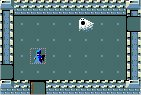</td>
		</tr>
		</table>
		

			I find a variety of scrolls, potions, wands and foods.  So much I barely know what to do with it all.
			I'm not able to identify much if any of it, but I know I've stumbled upon items of great value.  I'm able
			to carry everything I want without slowing down, but I'm not sure how much more I'll be able to carry.  I safely
			tuck a magic marker into the pocket of my robe.  When I know more about magic, I'll be able to use
			this to write my own scrolls and spellbooks!
		

		

			A headstone near the treasure marks Darius' grave.  He was apparently killed by a rothe.  My best guess is
			that he successfully killed most of a rothe pack before he fell, and then I killed the remaining two upon
			my arrival.  I hope that whoever stumbles across my grave gives more consideration than I gave Darius.
		

		

			A leprechaun steals some of my gold when I allow him to get too close, and I chase him all over the level
			firing force bolts at him left and right.  When I finally think that I have him cornered, he escapes
			downstairs to the next level.  I'd like to go back up a little and regroup, but I'll be damned if I'll
			let a little munchkin like that run off with anything of mine.  I follow him down.
		

	</td>
	<td>
		

			This section describes a "Bones Level" in NetHack.  Whenever an adventurer dies, there is a chance
			his final level will remain in the game for another adventurer to discover.  Most of the items will
			be cursed, but that can be taken care of.  There are certain items (such as the Amulet of Yendor) that
			simply won't ever be found on a bones level, but other than key items of that nature, pretty much
			anything can be found.  I consult the game log and see that Darius was a human monk I played about a
			week before this game.
		

	</td>
</tr>
<tr>
	<td>
		<table class="innertable">
		<tr>
			<td style="width:25%">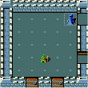</td>
			<td>
				

					I emerge on level 6 of the dungeon and the leprechaun strikes again immediately, stealing more gold
					and teleporting away.  Chasing him in anger, I get blinded by an exploding flash of light.  I retreat
					carefully back to the stairs, but I have no way to remedy my ailment.  I grab my quarterstaff firmly
					so that I might be able to defend myself from whatever lurks in the darkness.  In my flailings, I manage
					to kill one attacker before I can see again.  I consider myself lucky and move on.
				

			</td>
		</tr>
		</table>
		

			After much chasing, I finally kill the leprechaun and reclaim my gold, plus his.  I can't be sure what
			I had before his theft, but I have over 1000 pieces now.  I also recover a red spellbook from the room
			I killed him in.  Happy with my bounty thus far, I head back towards the chest I set aside in the
			dungeon above.
		

	</td>
	<td>
		

			If you don't have any gold in your possession, leprechauns can't steal from you and are much easier
			to kill.
		

	</td>
</tr>
<tr>
	<td>
		

			On the way back up, I notice that there are hill orcs all over the place.  These represent a great danger
			to me and I use up almost all of my energy hitting them with force bolt after force bolt.  They travel in
			packs, they are fairly well equipped, and they are skilled enough combatants to come at me with missile
			weapons and wands.  Fortunately the most dangerous wand any of them had was a wand of make invisible.
		

		

			Back in the safety of the second dungeon level, I once again take stock of my items and status
		

		

			Artius the Thaumaturge St:15 Dx:17 Co:14 In:16 Wi:10 Ch:10 Chaotic 
			Dlvl:2   $:1053  HP:46(46) Pw:25(94) AC:9 Exp:8 T:3819
		

		

			Through my vigorous activity (and a can of spinach I found and ate), most of my stats have improved or
			at least stayed the same.  I'm not level 8 and have a comfortable amount of hitpoints.  Even ignoring
			the benefits of regeneration, I can cast 18 Force Bolts in a row.  I know that more powerful spells
			await my discover, but their casting cost will be higher and I'll need even more power.
		

		

			I decide to head down the other staircase, but before I do, I'd like to try to improve my equipment.  I've
			seen some armor items lying around the dungeon that I was afraid to try on at the time.  I'd like to sift
			through my pile of unidentified items too and see if there's anything I can use immediately.  I decide
			that my two most immediate needs are armor and spells and commit to using as many of my four identify
			scrolls as necessary to improve my standing in those two areas.  I'd like to save an identify scroll or two
			if possible, but I'm sure I'll find more later so if I end up using them all, so be it.
		

		

			I don't know how many charges it has left, but I can also use my magic marker (or, should I say Darius'
			magic marker) to write additional identify scrolls.  All I need is some blank paper.  I consider that a
			last resort for now though, because I'm sure there are more powerful scrolls I'd like to write later.
		

		

			I remember seeing a leather armor on this very level, so I head out to go claim it.  Along the way I
			encounter more beasts, this time a rothe, a shrieker and a floating eye.  Feeling adventuresome I feast
			on the floating eye corpse.
		

		
You feel a strange mental acuity

		

			I can't be too sure, but it's almost like I sense things around me.  Nothing I can pinpoint but I have
			a greater sense that something is out there.  I don't want to get sidetracked from my current effort
			though, so I return to the chest I've set aside with the armor.
		

	</td>
	<td>
		

			To this point in the game, I feel that things have been fairly normal.  I haven't had any exceptional
			good or bad luck yet.  Probably the best thing that happened to me was finding Darius' bones level, though
			the benefits are uncertain as I haven't identified that treasure.  Darius was also obviously a starting
			character so he wouldn't have any premium items.  The magic marker is likely the best item he had.
			  
			The worst luck I had was losing Oscar on the first level.  It's not unheard of, but I expected him to last
			much longer than that.  Initially, traps are the greatest threat to a pet, as demonstrated in this game.
		

		 
		

			One item I have in my possession at this point is a tripe ration.  If you eat it, the game responds
			with "yuk - dog food."  I don't know if one is enough, but if I have 2-3 of them, I can feed them
			to a feral animal (such as a dog or cat) and coerce them into being a new pet for me.
		

	</td>
</tr>
<tr>
	<td>
		<table class="innertable">
		<tr>
			<td>
				

					The room I've chosen for my staging area has three doors, doors that I have intentionally left intact.
					In order to put on my leather armor, I'll need to take off my cloak, and I don't want anyone wandering
					in while I'm changing.  I don't feel the need to lock the doors, but I could do so using a skeleton key
					I found somewhere in the dungeon.  It's a handy item as I can use
					it to lock and unlock just about anything I'll encounter.  If I was deeper in the dungeon, I'd use
					it now to lock all the doors.
				

			</td>
			<td style="width:25%">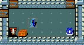</td>
		</tr>
		</table>
		

			The leather armor I picked up has metal studs all over it.  Metal armor will normally interfere with my
			magic, but I'm not sure if this qualifies.  Certainly a little metal won't do much harm though
			so I put it on.  I immediately try to take it off again to see if it's cursed or not.  I had
			decided that if it was cursed, I would just use my scroll of destroy armor to get rid of it then
			go look for another piece of armor.  Luckily, this item is not cursed, and my armor class is
			reduced significantly.
		

		

			I use an identify scroll on my two spellbooks and learn that I've found a cursed Book of Protection
			and an uncursed Book of Magic Missile.  I read the Magic Missile book and add that spell to my
			repertoire.  Magic missile is significantly more powerful than force bolt and won't damage or
			destroy objects.  I decide that knowing the protection spell is worth the risk of reading a cursed
			spellbook.  Fate is not on my side though, and the book crumbles.  I am stunned and when I awaken
			I've somehow been removed from my enclosed chamber.  I scurry back and promise myself not to
			make that mistake again.  On my way back, I destroy a paper golem and claim several blank sheets
			of paper.  Now I have something to use with my magic marker if I so desire.
		

	</td>
	<td>
		

			When you attempt to cast a spell, the game displays all your known spells and lists your failure chance
			for each.  After putting on a piece of armor, I like to double check to make sure that I'll still be
			able to cast what I need.  In this case, the failure rate for both Force Bolt and Magic Missile are 0%
			when wearing the studded leather armor.  That doesn't mean the armor isn't limiting spellcasting in some
			minor way, but it does mean that I don't care whether it does or not.  If I wore something like plate mail
			armor, I'm sure my failure rates would be near 100% across the board.
		

	</td>
</tr>
<tr>
	<td>
		

			I also identify a pair of gloves I found on Darius' grave but learn they are cursed.  They have
			been enchanted to +2 though, so I put them in my chest for later.  At some point, I hope to be
			able to uncurse items.  I have a pair of metal shoes, but I don't even identify them at this point
			as I'm afraid about what that will do to my spellcasting ability.
		

		

			I dump the rest of my items into the chest and close it.  Leaving myself with the bare essentials:
			my staff, some food, and some utility items like my lantern and skeleton key.  I lug along a pick-axe
			that I earned from a victory over a dwarf.  I can use that in spots I'd been using force bolt
			before.  I sit down to rest and recover my power.
		

		

			While I'm resting, a ball of light slips under the Eastern door and explodes in my face, blinding
			me.  My limited sense of nearby creatures is instantly clarified and I can see a small hoard of
			enemies collected outside my doors.  If they were intelligent, they would be able to open the doors
			and come in.  It's just a pony, some grid bugs and a rothe though, so I'm safe for the time being.
		

		<table class="innertable">
		<tr>
			<td style="width:25%">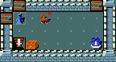</td>
			<td>
				

					Something manages to get the door open and the creatures stream in.  I'm still blinded and can
					sense most of them, but whatever opened the door remains invisible to me.  When it strikes, I respond
					with a magic missile and take it out.  Since I can sense them, the other creatures fall quickly as
					well.  When the horse approaches, I throw some apples his way and he eats them peacefully.  When
					the dust settles from the engagement, he nudges me with his muzzle asking for more apples.  I comply
					and make a new friend.  More importantly, I have a new pet.
				

			</td>
		</tr>
		</table>
	</td>
	<td>
		

			There are two key elements here - determining if an item is cursed, uncursed or blessed and determining
			the specific nature of the item.  There are ways to do each independently, but an identify spell will
			tell you everything there is to know about an item.
			  
			Don't bother writing down the identities of items - the game will remember for you.  The identities change
			each game as well, so thinking that THARR is a scroll of teleportation will do you more harm long-term
			than good.  Once you identify THARR (or whatever the label might be), you'll never see that label again
			and will instead see the true identify whenever you find objects of that type.
		

	</td>
</tr>
<tr>
	<td>
		

			Animals have an innate sense about them, so I throw my metal shoes to the horse.  If they were cursed, he
			would sense it and back away, but instead he sniffs them, knocks them over with his nose, and then
			slowly walks to the fountain in the room for a drink.  Knowing they are safe, I slip them on and feel
			very well protected.  If I find later that I'm having trouble casting spells, I'll just throw these
			shoes away.
		

		

			I can tell immediately that this is a good horse, and every good horse needs a name.
		

		What do you want to call the pony:
		Triumph
		

			Triumph is a much sturdier companion than Oscar was, so he'll be more helpful in combat.  I no longer
			feel the need to fully replenish my power and am ready to continue adventuring.  If I had a saddle, I
			might be able to ride Triumph through the dungeon, but I was never much of a rider and I bet I'd fall off.
			Perhaps in more pleasant times I shall ride my horse and we'll reminisce about our adventures together.
		

		

			Though I can barely lift it, Triumph pushes my box of items around like a toy.  I'm not really happy
			about this, but I know if I try to discourage him, he'll only do it more.  I walk towards the unexplored
			staircase on this level and hear his footsteps following me down the corridor.  I'm sure I'll be able
			to find that box again when I return, wherever he left it.
		

		

			As I approach the stairs I seek, one final goblin makes an attempt at my life.  I step back and allow
			triumph to pound him to dust.  Triumph isn't bothered by the close proximity of his iron skull cap, so
			I grab it and put it on.  I now have the protection I need to defend myself against falling rock traps
			like the one that claimed Oscar.
		

		

			Wearing all this armor protects me, but I feel that I can't cast Force Bolt as effectively as before.
			Being a wizard though, I have a special affinity for Magic Missile and am still able to cast that very
			effectively.  It's a more expensive spell, but also more powerful, so I decide to keep my armor and
			switch to magic missile as my primary spell.  I spent a little bit of time training and feel that my
			general understanding of offensive magics has improved significantly.  More powerful and better defended
			I continue down the stairs with Triumph immediately behind me.
		

	</td>
	<td>
		

			The exact way this technique works is as follows: A pet will never walk over a cursed item unless
			it feels it has to.  If it does walk over the item in those circumstances a message will read "XXX moves
			reluctantly".  If even one item in a pile is cursed, the pet will avoid the entire pile.
			  
			In this case, I just drop the boots and wait to see if my horse walks over them or not.  Since there's lots
			of space in this room, he would never do so willingly.  I waited for 5-10 turns and as soon as he touched
			the boots, I knew they were safe and put them on.
		

		 
		

			If you want your pet to follow you from level to level, make sure they are by your side when you use
			a staircase.  If you leave them behind, they'll be there waiting for you when you return.
		

	</td>
</tr>
<tr>
	<td colspan="2">
</td>
</tr>
<tr>
	<td>
		<a name="mines"><h1>The Gnomish Mines</h1></a>
		<table class="innertable">
		<tr>
			<td>
				

					We descend into a very large chamber carved out of solid rock.  Two gnomes guard the entry, armed
					with clubs.  I decide to see what Triumph can do so I stand my ground while she charges in.
					Seconds later she has caved in both their heads and is looking for more.  I think this is the start
					of a wonderful relationship between the two of us.
				

				

					We start to wander around together.  I allow Triumph to handle most everything we encounter while
					I continue to replenish my energy.  This strategy ends up being foolhardy, as I've overestimated
					the strength of my pony.  Triumph falls to a dwarf armed with a short sword, and I am forced to
					dispatch the enemy with a magic missile.  Triumph dies in my arms as I have no healing powers
					that can save him.  I think he was happy to have found a friend before his life ended though.
				

				

					So it seems that once again there is a job opening for "adventurer's pet."  I doubt any creature
					will be rushing up to fill that spot anytime soon though, given the short lifespan of my pets to
					this point.  I'll need to cooperate more with my pets in the future if I want them to live longer.
				

			</td>
			<td style="width:25%">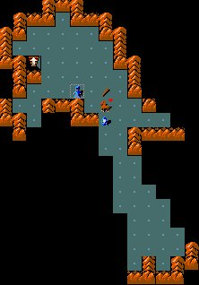</td>
		</tr>
		</table>
	</td>
	<td>
		

			The Gnomish mines are a lot more open than the dungeons of doom.  In general there are many more
			creatures and items down here than in the dungeon levels I've already been to.  My goal is to descend
			at least as far as the town and hopefully set up a temporary base camp down there.
		

	</td>
</tr>
<tr>
	<td>
		

			I have no time to mourn though, as dwarves, gnomes and bats pour out from multiple passages.  I grab a
			silver wand from the hands of the dwarf that killed Triumph and rush into battle with my quarterstaff.
			The enemies come at me from multiple directions, so I'm unable to line them up for a single magic missile
			blast.  I'm afraid to rely on this spell to extensively because I have no idea what might wait around
			the next corner.  With my energy at about half of it's capacity, I need to carefully consider each
			spell I use.
		

		

			A sole bat comes at me, from where I do not know.  I decide to try out the silver wand I find on the bat.
			Suddenly, the bat starts moving about twice as fast and attacks me vigorously.  I have successfully
			identified a wand of speed monster.  Thank Anhur I used it on a bat and not something more powerful.
		

		

			Before I know it, I'm knee deep in killer bee corpses.  Bees, gnomes and hobbits charge at me.  Fortunately
			they struggle to fit through a small passage in the mines and I am able to avoid getting surrounded. I
			am covered in stings, and think about retreating, but I manage to gain the upper hand and continue.
			A band of Uruk-hai ambush me, and I barely survive.  My armor, while a significant improvement on what
			I had previously, is barely sufficient to handle the punishment.  I use my speed advantage to line up
			magic missile shots and kill the five attackers with a total of three missiles.
		

		

			I find the stairs down, but decide to continue exploring this area first.  I'm alive but depleted and I
			can't say that I have great confidence that I'll be able to complete my descent into these mines without
			having to turn back.
		

		

			The onslaught continues on level two of the mines.  Creatures swarm the entry from all directions and I
			let fly with my full arsenal.  I gain another experience level and am now level 9.  My confidence grows
			as once I establish myself on a level, I feel I can hold my own there.
		

		<table class="innertable">
		<tr>
			<td style="width:25%">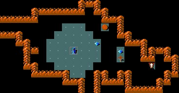</td>
			<td>
				

					I collect a few more minor items, including an ornate lamp.  Now I have two light sources.  I head downstairs
					again, this time to level 3 of the mines.  This level is very dark, so I'm glad I brought those lamps
					with me.  I light one and continue.  I can't see nearly as far as I could on the lit levels of the mine
					but without the light source, I would barely be able to see at all.  My rate of travel slows as my
					uncertainty rises.
				

				

					I find a cloth sack and take it with me.  It will help me to organize my belongings as my arsenal
					grows.  Eventually it will serve the same purpose as the chest I left behind, but is much lighter
					and easier for me to carry.
				

			</td>
		</tr>
		</table>
	</td>
	<td>
		

			One reason I'm being so cavalier in charging through the mines is that I have not bothered my God yet, so
			I know I am in his favor.  If I get in trouble, I can <b>pray</b> and he will likely help me.  A God can
			do anything he chooses - he might heal me, dispatch my hunger, cure an ailment or remove curses.  He is
			a fickle God though, if I pester him, he might curse me, dispatch a daemon to destroy me or smite me
			directly with a lightning bolt.
		

	</td>
</tr>
<tr>
	<td>
		

			Finally I descend into the mine town.  This level is lit, so I turn my lamp off.  I don't want it to
			run out of oil.  There are still a couple of creatures, including a very powerful plains centaur that
			stand in my way.  Knowing that I'll be reasonably safe on this level though, I don't hold back any
			magic missiles.  I feast on corpses until I'm full and head into the center of town, passing a few stores
			on the outskirts.  I look inside the stores, but don't see anything of particular interest to me.
		

		<table class="innertable">
		<tr>
			<td>
				

					I arrive at my destination.  There is always a temple somewhere in minetown, usually towards
					the middle.  Stepping through the doorway, I feel a strange sense of peace and realize that this
					is a temple to my God Anhur.  Fortune has smiled on me, and I know I will be safe in this home
					away from home.
				

			</td>
			<td style="width:25%">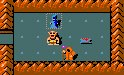</td>
		</tr>
		</table>
		

			I find that if I touch an item to the altar, I can instantly determine whether it is blessed or cursed
			because the altar turns different colors.  I do this with all of my items to increase my awareness of
			my own possessions.  I complete my exploration of the minetown, then decide to head back up to my camp
			above and see how much stuff I can carry down here.
		

		

			<a href="minetown.jpg" target="_blank">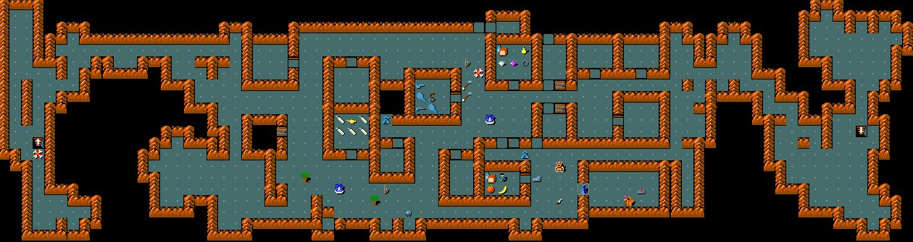</a> 
			Minetown Map (click to enlarge)
		

		

			On my way up, I encounter a wild dog which I tame with a tripe ration.
		

		What do you want to call the little dog:
		Fang
		

			Sadly, Fang and I are overcome with a swarm of soldier ants.  Bloodied and barely alive, I was forced to
			unleash a magic missile into the last soldier ant.  The missile tore through the ant but poor Fang,
			standing helpless on the other side did not survive the impact.  "Goodbye Fang - I hardly knew ye," I
			murmur as I bury his corpse.  I begin to question my continuing desire to have an accomplice in my
			missions.
		

	</td>
	<td>
		

			The minetown is the first special level I've come across so far.  There are 3-4 fixed layouts that all
			contain more or less the same elements.  It's important because there are several stores and a temple.
			Stores are a great concentrated source of items, and temples have a variety of benefits.
		

		 
		

			Temples can be either lawful, neutral or chaotic, just like characters.  When a temple is the same
			alignment as you are, it's referred to as "co-aligned" and offers additional benefits.
			  
			Using any altar in the game, you can determine the blessed/cursed status of items.  Donating money to any
			priest you find can lower your armor class, if you donate the right amount.
			  
			With a co-aligned altar though, you can generate holy water and sacrifice corpses to your God.  This has
			a series of benefits; some are obvious while others are subtle.
		

	</td>
</tr>
<tr>
	<td>
		

			I make it finally to my stash of loot and find that it would take me several trips back and forth to
			take everything to the altar and back.  I decide against doing this at this time and head back to
			minetown to continue my adventure.
		

		

			Deep in the mines, past the town, my powers begin to fail me.  Many times I am forced to flee from combat
			in the face of great danger.  I can no longer hold back any magic missiles and am forced to deplete
			myself regularly.  Once, nearing death, I pray to Anhur to save me.  By His hand I was healed and given
			the strength to deliver the final blow to a vile creature that held my life in his hands.
		

		<table class="innertable">
		<tr>
			<td style="width:25%">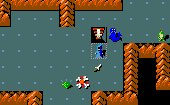</td>
			<td>
				

					Realizing I was outmatched, I turned back to return to my basecamp only to fall even deeper into the
					dungeon through a pit trap.  Once I landed, some creature began hunting me telepathically.  My newly acquired
					skill might be my undoing.  Moving quickly and stopping to fight with my staff only when necessary, I
					managed to find the stairway leading back to the upper levels of the mines.  Waiting for me there was a rust
					monster I had gone out of my way to avoid previously.  I won the battle, but several of my armor items
					were damaged by him.
				

			</td>
		</tr>
		</table>
		

			  I would have to replace them soon, or find a way to reverse the damage.  Using all my speed, I fled
			  from the mines, not even stopping in minetown to say goodbye.  Before I knew it, I was resting in my
			  camp on the second level of the dungeon.  I vow to return to the mines later to take care of unfinished
			  business.  For now though, I resume my previous path.
		

	</td>
	<td>
		

			I was actually near the bottom of the Gnomish Mines here, and there is an item down there that I'd like
			to have.  I was just not powerful enough to survive at the very bottom though and rightly fled.
			  
			Part of the reason that I was not powerful enough is that I relying on only two weapons - magic missile
			and my quarterstaff.  I need to make a more concerted effort at this point to start using wands and
			the other magical devices I've collected.  I prefer to identify my items en masse, but in this game I'll
			have to just do whatever I can to empower my character.
		

	</td>
</tr>
<tr>
	<td colspan="2">
</td>
</tr>
<tr>
	<td>
		<a name="sokoban"><h1>Sokoban & The Oracle</h1></a>
		

			Before I head down the stairs, I collect my unidentified rings and wands and identify them.  Unfortunately
			nothing really thrills me, so I dump it all back in the chest.  The only good news I can take away from
			this is that if I come across more unidentified items, the chances are increased that they will be more
			useful to me.
		

		

			When I read my second identify scroll, somehow all of the items in my inventory are identified at once.
			I'm not sure exactly how this happened, but I'm grateful.  I wish I had been holding more of my items
			though as I had a good amount of scrolls and potions sitting in my large box when this happened.
		

		

			I breeze through the levels I had already explored and emerge on level 7 of the dungeons of doom.  Here I
			come across a locked chest which I open using my skeleton key.  Inside I find a mix of small items, but
			most importantly I find a new spellbook.  I put these items into my sack and continue.  They should be
			better protected in there than just lying loose in my backpack.
		

		<table class="innertable">
		<tr>
			<td style="width: 25%">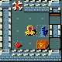</td>
			<td>
				

					A hoard of monsters guard a throne room.  After I dispatch them, I find a new wand in a locked chest for
					my efforts.  I think about sitting in the throne, but the way my luck has been going lately, I figure I'd
					better just explore the rest of the level.  Around the next bend, I'm swarmed by bees again.  My magic
					missiles cut through the swarm.  I emerge depleted and wounded.
				

			</td>
		</tr>
		</table>
	</td>
	<td>
		

			The blessed status of an identify scroll determines the chance of your entire inventory being revealed
			to you.  An uncursed one has a slight chance, a cursed scroll has no chance and a blessed scroll has a
			significant chance, around 25% from what I recall.  The best strategy is to load up your character with
			a ton of unidentified items and read a couple blessed scrolls back to back.  I have no blessed scrolls
			and wasn't expecting this to happen.
		

	</td>
</tr>
<tr>
	<td>
		

			My next encounter is with a majestic white unicorn.  Unicorns are pets of the Gods, and I know that
			Anhur prefers black unicorns, so I am duty bound to hunt this creature as it is the pet of a competing God.
			Hoping to collect a trophy of my hunt, I move in with my quarterstaff by am quickly repelled.  I return
			to the level above to recover and rethink my strategy.  Unicorns are fast and hard to pin down with missile
			weapons and spells, but I am no match for the unicorn up close.  When I'm healed, I plan to use my telepathy
			to track the beast throughout the level, and hopefully trap it in a small room or corridor where it cannot
			avoid my magic missiles.
		

		<table class="innertable">
		<tr>
			<td>
				

					When I come back down, I find not one unicorn, but two!  A gray unicorn has joined the white one,
					and I manage to lure them into the same chamber.  The unicorns are wily creatures, intentionally
					staying out of any direct firing lines.  They also try to avoid contact with me and keep their
					distance.  We dance around the room for a bit.
				

			</td>
			<td style="width:25%">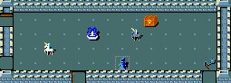</td>
		</tr>
		</table>
		

			Whenever I get too close, I receive heavy damage for my trouble.  When I back off, they never let me
			line up a shot.  I don't think I can survive at close range long enough to kill them, even with my
			spells.  After a little bit of practice, I become adept at lining up magic missile shots to
			bounce off the walls of the chamber to strike the beasts.  I use up all of my energy firing
			missiles, but claim two unicorn horns for my trouble.
		

	</td>
	<td>
		

			Unicorn horns are one of the best healing items in the game, especially when blessed.  By <b>applying</b>
			it to myself, I can heal blindness, sickness, confusion and just about any other malady that I might
			come across.  It will also heal attributes that have been damaged through various encounters.  So long
			as the unicorn doesn't share my alignment, I'll do whatever is necessary to kill the first one I find
			and collect the horn.
		

	</td>
</tr>
<tr>
	<td>
		

			Disaster strikes while I am resting.  Some giant ants stumble upon me - I was unable to find an enclosed
			chamber.  I use what little power I have remaining fending them off when a yeti charges into the room.
			I flee, following the corridors wherever they lead me.  I'm not fast enough though, and he continues to
			gain.  I hope to run for long enough to be able to cast at least one magic missile, but I fear that won't
			be enough.
		

		

			The corridor ends in a slight gap and I'm carrying too much to squeeze through.  I have no time to drop
			anything either as the yeti is only a few steps behind me.  Lacking the power to cast magic missile, I
			grab a wand of striking from the folds of my robe and start firing away.
		

		

			The Yeti absorbs the first blow without showing any reaction and knocks me to the ground with a series
			of blows and bites.  I fire again and he yowls but continues the onslaught.
		

		

			I'm running out of options.  I can barely raise my arm to trigger the wand.  I once again call on Anhur
			to save me and am showered with light.  The yeti pulls back, unable to attack, but stands right over me
			ready to resume any second.  When the light fades, I am back where I was before.  Anhur has not healed
			me or provided me with the energy to cast magic missile.  Still I am thankful for were it not for Him,
			I would already be dead.
		

		

			With my last gasp of energy, I raise the wand again and close my eyes, ready for the end.  I feel the
			heat of the yeti against my flesh, and then nothing but soft warmth.  I never expected death to be so
			peaceful.  I struggle to breath - this can't be right.  Panicking, I open my eyes and start to struggle.
			Apparently soft warmth is not the feeling of death, but rather the feeling of a yeti corpse falling on
			you after you are lucky enough to have killed it.
		

		

			I am rewarded for my efforts with a new experience level:
		

		

			Artius the Magician St:16 Dx:18 Co:16 In:16 Wi:12 Ch:11 Chaotic 
			Dlvl:6 $:1670  HP:11(73) Pw:10(146) AC:4 Exp:11 T:13028
		

	</td>
	<td>
		

			This battle with the yeti was very intense and exciting for me as a player.  I was certain that I was
			a goner when he reduced me to 2 HP!  I had no idea how many charges the wand of striking had, but it
			certainly had "just enough."
			  
			The wand of striking is actually the same as my force bolt spell, just in wand form.  It's probably
			the weakest offensive wand, but it was all I had handy.  Even if I had had something in the bag I was
			carrying, I wouldn't have had time to pull it out once I got cornered like that.  I really was out
			of options.
		

	</td>
</tr>
<tr>
	<td>
		<table class="innertable">
		<tr>
			<td style="width:25%">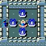</td>
			<td>
				

					I encounter a human calling himself the Oracle.  He promises to guide me in exchange for a donation, but
					I refuse for now.  I don't need some crusty old man living in a dungeon to tell me I need to go further
					down.  Maybe later, if I can't find my way I'll return and talk to him.
				

			</td>
		</tr>
		</table>
		

			Immediately below the oracle, I come across a store selling
			some minor spellbooks, scrolls and foodstuffs.  I already have the books he's offering, and I am having
			trouble moving given all the items I already carry.  I decide that now would be a good time to return to
			my stash of loot and rest.  In completing my circuit of this level though, I find an extra staircase
			heading upwards.  I have time to decide, since I'm heading back for now, but I think I'd rather head up
			through a different route than keep going down.  I find that I'm struggling a bit against some
			of the stronger monsters down here.
		

		

			Back at my camp, I luck out with an uncursed identify scroll and reveal my entire inventory again.  This
			time I'm holding all sorts of items I was curious about, and now know most of what I have access to.
			Best among the items is a wand of polymorph.  I can use that on myself, a pet, an item or a monster,
			depending on what effect I'm looking for.  Also I have several scrolls of enchant armor, including one
			that is already blessed.  I'll use these soon to lower my armor class.  I identify three new spellbooks:
			clairvoyance. confuse monster and cure blindness. I'll read them soon, but I doubt I'll use these spells
			very much. Finally, I have a wand of teleportation with 6 charges in it.  This is a useful defensive weapon.
			If I'm in trouble I can use it to send my opponent to some nearby random location.  If surrounded, I can
			use it on myself.
		

		

			I also grab a couple of extra wands for my continuing journey.  The wand of striking I used against the
			yeti is almost spent, so I grab another one of those.  I also grab a wand of digging.  That will be
			helpful at times when using my pick-axe is too time consuming.  I stash most of the rest of my gear in
			the box and head back down.  Once again, I'm fully healed, traveling light, and have about 60% of my
			maximum power.  If I can rely on my quarterstaff on the way down, I should be mostly energized when I
			make it to where I turned back.
		

	</td>
	<td>
		

			The Oracle is one of the keys to the game if you are an inexperienced player who is trying to win
			without relying on Internet spoilers.  Not all of his information is accurate, but he has some cryptic
			clues that reveal important secrets.  He's more useful than a fortune cookie, but far more
			expensive.  I can't say that I recommend giving him money ever unless you're simply curious.
		

	</td>
</tr>
<tr>
	<td>
		<table class="innertable">
		<tr>
			<td>
				

					I enter the newly discovered branch of the dungeon and am greeted by a sizable collection of
					boulders and pits.  I feel strong magic flowing through the level and notice that my movement
					is restricted in ways I am not used to.  I can longer squeeze between two boulders.  I can push
					boulders like before, but only to the compass points.  Worse yet, the pits produce some form
					of suction.  Even if I had the power, I don't think I could jump or fly over them without
					getting sucked down.
				

				

					I begin rolling boulders around the level.  When I manage to line one up, I push it into a pit
					to fill it in.
				

			</td>
			<td style="width:25%">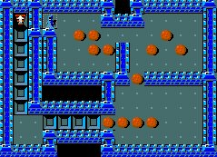</td>
		</tr>
		</table>
		<table class="innertable">
		<tr>
			<td style="width:25%">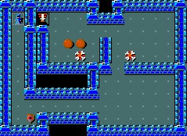</td>
			<td>
				

					With sweat pouring down my face, I emerge past the pit traps at the next staircase.  For my
					trouble I am stronger, and managed to pick up some additional items.  Here and there I come
					under attack from a variety of creatures.  Since my encounters are sporadic and usually involve
					only a single foe, I am able to easily dispatch them and still replenish my power.
				

				

					Heading upstairs, I encounter more of the same.  I find things more challenging though as there
					is less space for me to work in and a smaller margin for error.  I count up the boulders and
					pits and determine that I need all but 3 of the boulders to build a bridge to the stairway.
				

			</td>
		</tr>
		</table>
		

			I think carefully, for one wrong move could pin a boulder against a wall, and I will be left with no
			recourse.  After much deliberation I slide the first couple of boulders into the pits and things open up.
			With more space to work in, I have no trouble moving the rest of the boulders into place.  I fight through
			a chamber of creatures and find another staircase.
		

		

			On the 3rd puzzle, I accidentally push too hard on a boulder.  It fills a pit and I stumble past, falling
			into the next pit in the line.  I am sucked down the hole with such veracity that I land on the first
			level again.  I add to my list of mistakes not to make again.  When I arrive back on the third level,
			I continue my manipulations and one by one the boulders fall.
		

		

			I find more treasure in a large chamber surrounding the next staircase, but have to fight for it.  With my
			full complement of magical energy, I'm able to fire magic missiles at will and quickly empty the room.
			I feast on my victims until I am full, then proceed upwards.
		

	</td>
	<td>
		

			This is the first of 4 Sokoban levels, based on the puzzle game of the same name.  There are two possible
			maps for each level, so each game will mix and match the challenges for you.  Some people feel that these
			puzzles are misplaced in NetHack (and those people should remember to spell "Sokoban" correctly when they
			search for solutions on the Internet).  Passage is not required, but a valuable prize awaits any who can
			complete this section.
		

		 
		

			There are several in-game ways to cheat in Sokoban, but they lower your character's luck.  You can destroy
			boulders that are blocking you with a pick-axe or force bolt spell.  You can also create new boulders
			with a scroll of earth.  There is no way to complete Sokoban without filling in the pits though, don't
			bother looking for a creative way past this section.
		

	</td>
</tr>
<tr>
	<td>
		<table class="innertable">
		<tr>
			<td>
				

					Upon entering the next level, I immediately sense that this is the last.  Temporarily blinding
					myself, I detect a massive concentration of enemies in the final chamber.  All of my favorites
					are there including a rust monster, an owlbear and a cockatrice.  I shiver and get to the task
					of manipulating the boulders.  Multiple enemies make my work harder, but not impossible.  When
					the last boulder drops into place, I am riding a tidal wave of momentum.  I open the door and
					fire a continuing stream of magic missiles into the treasure chamber.
				

				

					Enemies fall left and right, leaving behind a huge assortment of items and treasures.  Their ranks
					are refilled immediately though as more and bigger creatures attempt to pile through the doorway.
				

			</td>
			<td style="width:25%">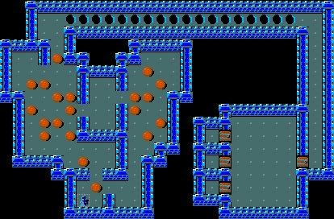</td>
		</tr>
		</table>
		

			At one point, I try to close the chamber door and lock it to rest, but the pile of corpses in the
			doorway prevents me.  I run back down the hallway, and am fortunate that a slowly moving ochre
			jelly blocks the other creatures from following.
		

		

			Once I heal a little, I return to clean out the rest of the treasure chamber.  In a closet towards the
			back, I find an amulet which I immediately put on.  I figure if this item was so well guarded, it must
			be valuable and I intend to use it.  I load up on treasures including some fantastic looking boots and
			gloves.  Once again, I have trouble moving with all the weight I'm carrying, so I decide to head back
			to my camp.
		

	</td>
	<td>
		

			The final prize at the end of Sokoban is always either an amulet of reflection or a bag of holding.
			Personally, I prefer the bag of holding for it's general utility, but for this character, the amulet
			of reflection is actually a better prize for me.  Either way, I have no control over what I receive
			so I'm happy with either.
		

	</td>
</tr>
<tr>
	<td>
		<a name="plea"><h1>A Plea for Help</h1></a>
		

			I arrive back at my camp on the second level realizing I need help if I am to continue.  Things have
			not gone to plan thus far.  I've reached my limits both in the mines and in the main dungeon.  I've
			explored all of the areas I feel comfortable in, and several others that I do not.  I've looked death
			straight in the eye on several occasions, but have thus far managed to escape its grasp.  I cannot
			continue like this, as I know my luck will run out soon.  I'm on borrowed time as it is.
		

		

			I load up again with the items I am most curious about and prepare to head back to the mines.  If I can't
			find something special in this collection, I might as well admit defeat and go back home, because I know
			I'll die if I don't find new weapons for my arsenal.
		

		

			I have no new spellbooks this time, but I do have the nice looking gloves and boots.  They don't match
			but I'm not entering a fashion show.  Maybe one or both will help me.  I grab a collection of other
			unidentified items as well as my last identify scroll.  Maybe I'll get lucky with another mass-identify,
			but I'm not counting on it.  Finally I see a handful of create monster scrolls.  It's risky, but I think
			I know how to best put these to use.
		

		

			On my way to minetown, a gnome fires a wand at me.  The bolt hits my amulet and reflects back, killing
			my attacker.  My fortune is already improving as the amulet from the puzzle levels, combined with my
			cloak of magic resistance will protect me from most magical attacks now and in the future.  Protected from
			magic, I place renewed importance on my physical protection and remain hopeful that my new boots and gloves
			will provide for me.
		

	</td>
	<td>
		

			I have done a very poor job this game in dealing with my armor.  I have ignored most of the loose items
			I've come across and been on the lookout the whole game for the super high-end items.  An experienced
			player can immediately tell the difference (based solely on the description) between a standard item
			and an enchanted item.  Not all enchanted items are good though, so it's important to verify that the items
			are not cursed before trying them on.
		

	</td>
</tr>
<tr>
	<td>
		

			Safely in the minetown temple, I immediately touch my boots and gloves to the altar.  Neither is cursed and my
			heart skips a beat.  I put the shoes on first and attempt to run around the room.  If they were boots of
			speed, I would know immediately.  Unfortunately, I am no faster than before.  Next, I try to jump.  I
			jump several paces and do so with great ease.  I guess there are worse things to find than jumping boots,
			but there are better ones too.  I leave them on for now and try the gloves.
		

		

			As I slide the gloves on, I feel a tremendous surge of power.  I no longer feel the burden of my items
			slowing me down.  The priest remarks, "Nice gauntlets of power you have there," and I agree.  I can feel
			the gauntlets already disrupting my magical powers, but I know that I can still deliver magic missiles
			like a champion, so I decide to keep them on for the time being.  Certainly if I ever decide to take them
			off, I will keep them close by.
		

		

			I'm happy that neither item is useless.  They are not perfectly suited to my needs, but beggars can't
			be choosers.  Needing more help, I decide to submit myself to Anhur's service in order to find guidance.
			I head out into minetown looking for a victim for my God.  I know that if anyone is going
			to provide me with the tools I need to survive, it will be Him.  I kill a jaguar and drag the corpse
			back to the altar.  When I <b>offer</b> the corpse to Anhur though, he ignores it.  The priest asks that
			I kindly get that decomposing corpse out of his temple and I realize that the meat probably wasn't fresh
			enough.
		

		

			I blind myself and reach out telepathically to find more prey, but none reveal themselves to me.  As
			a last resort, I pull out my stash of create monster scrolls.  I vow to show Anhur my dedication no matter
			the risk to myself.  The altar indicates that one of the scrolls is cursed, so I read that one and the temple
			fills with creatures.  If Anhur wants fresh corpses, he shall have them.
		

	</td>
	<td>
		

			There are different tricks to determining what an item is without using an identify scroll.  The boots
			of jumping and gauntlets of power are two of the easier items to detect.  Once you figure out what something
			is, if the game hasn't already renamed it for you, you can <b>name</b> the item yourself.  You can name
			either an individual item or all items that look like this.  Once I name these jumping boots, the game
			will identify all such boots as jumping boots for the rest of the game (or until they are identified
			conclusively by an identify scroll).
		

	</td>
</tr>
<tr>
	<td>
		

			Pandemonium ensues as magic missiles are flying everywhere.  Savage beasts claw to get at me, and the
			priest runs for cover.  As my enemies fall, I fling their corpses on the altar and offer them to Anhur.
			The corpses are consumed by flashes of fire as fast as I can offer them and the priest drops to his knees.
			"Anhur our protector.  Accept these gifts and shower us with your grace," he screams over the sounds of
			combat.  I scoff as I know that the God of chaos desires not these words or any others.  He wants bodies and lots of them
			and I am determined to satiate him.
		

		

			More and more corpses are offered and I have successfully cleaned out the temple.  With each corpse offered
			I feel a surging hope.  I see signs of good fortune all over and read another scroll.  A giant ant appears
			in the middle of the temple and I dispatch it with my quarterstaff.  I offer the corpse and it is
			immolated and consumed.  And then it happens...
		

		
A voice booms: Use my gift wisely!

		

			I drop to my knees and tears of joy stream down my face.  Anhur has rewarded my efforts with the artifact
			blade Magicbane.  I set aside my ancestral staff and weep as I touch the blade.  I feel it's power surge
			through me.  I turn to face the priest and he is standing paralyzed, jaw opened.  Speechless.
		

		

			A grin stretches across my face, connecting my pointed ears.  "I'll be right back," I say to the priest
			as I rise holding my new weapon.  By the grace of Anhur and by the power of my gauntlets I am renewed.
			I charge upstairs to sift through my item collection again.  Now that I can carry more items, I plan
			on bringing everything back down to the temple for proper identification of their blessing.  I assume
			that he will have recovered by the time I return so that we can share our divine experience.  Magicbane
			carves a path through my enemies both there and back.
		

	</td>
	<td>
		

			The whole interaction of Gods, praying, altars, corpse offering and gifts is perhaps the most
			polished concept in all of NetHack.  I have touched on most of the key elements thus far in the report
			but there are plenty more benefits to be had from the God/player relationship.
		

		 
		

			Wizards always get Magicbane as their first artifact.  Aside from being a fine blade, Magicbane has a
			series of potent random effects it can deliver to it's victims.  As you enchant the blade to increase
			its power, the likelihood of it's special effects goes down.
		

	</td>
</tr>
<tr>
	<td>
		

			Upon my return, the priest asks to examine my gift.  I allow him that honor while I touch my remaining
			items to the altar.  When I'm done, he notes that a wizard of my power can surely spare
			a significant gift towards the upkeep of the temple.  I agree and hand over most of my gold.  The priest
			blesses me in return, and I feel a divine protection.  I unfurl my collection of enchant armor scrolls
			and enchant my cloak of magic resistance to +4.  Between the priests blessing and my enchantment, my
			defenses are more than doubled.
		

		

			Artius the Magician St:25 Dx:18 Co:16 In:16 Wi:13 Ch:11 Chaotic 
			Dlvl:6 $:708  HP:79(79) Pw:164(164) AC:-3 Exp:12 T:23275
		

		

			Concerned about the effects of the Gauntlets of power on my spellcasting, I attempt to unleash a force
			bolt upon a nearby wall.  It's been so long since I cast the spell that I can't remember it correctly and
			my mind becomes twisted from the effort.  I then attempt to read my last scroll of enchant
			armor to improve my cloak further.  I mispronounce the words though and the cloak shimmers in an odd way.
			When my head clears, I examine the cloak further with the priest.  We determine that it has somehow been
			rendered fireproof.
		

		

			I continue my experiments casting magic missile and struggle to recall it as well.  I successfully cast it
			but I feel the need to consult my spellbooks again to refresh my memory.  I head up to my stash and read
			the appropriate books.  When I return to complete my experiments, I determine that while wearing the gauntlets,
			magic missile is the only spell that I can reliably cast.
		

		

			I am still vulnerable but with my increased protection and the gift of Anhur, I feel ready to continue
			my adventures.
		

	</td>
	<td>
		

			Priests can convey many benefits when you donate money to them. When you <b>chat</b> with
			the priest and he will ask you to donate.  By far, the best reward is a reduction in armor class.  You
			receive this when you donate between 400 and 600 gold times your experience level.  For me, that was 4800
			gold.  You can reduce your armor class by up to 10 points through such donations.
		

	</td>
</tr>
<tr>
	<td>
		<a name="business"><h1>Unfinished Business</h1></a>
		

			I commit to exploring the rest of the mines, and require a new light source to do so as original lamps
			have long since run out.  Fortunately, there is a lighting store in right here in minetown, and I head there immediately.
			I am asked to leave my pick-axe outside and do so willingly.  I can see how thieves might use such tools
			to create a back door out of a store for themselves.
		

		<table class="innertable">
		<tr>
			<td style="width:25%">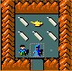</td>
			<td>
				

					The shopowner's name is Izchak, and he is very kind to me and shows me a fine oil lamp he has for sale.
					I pay him the 10 gold he asks.  As I leave the store, I could swear he says "Thank you for playing," but
					when I ask him to repeat himself he says "Thank you for shopping."  I pause in his doorway and he says,
					"You'd best be going - you have much to do and I know we'll meet again."  I ask him how he knows and he
					replies, "I just know."
				

			</td>
		</tr>
		</table>
		

			Izchak knows more I can tell, but he's keeping it to himself for now.  I head East through the town and
			head down the staircase.  I've been down here before, but I am much more deliberate in my searching now
			as I feel more in control of the situation.  I don't find much to add to my collection but I take comfort
			from knowing that I have taken all that I want.
		

		

			Deeper still I walk right into the arms of a Ettin mummy.  His two heads both howl the instant he
			recognizes me.  My memories return to me and I recall be chased by this very creature out of the mines
			during my last visit.  I invite him to carefully inspect Magicbane and he complies.  After four inspections,
			he falls.
		

	</td>
	<td>
		

			From the Usenet rec.games.roguelike.nethack FAQ:
			  
			Izchak Miller, one of the founding members of the DevTeam, passed away
			on April 1, 1994 from complications due to cancer. As he was
			responsible for, among other things, much of the shopkeeper logic, the
			owner of the lighting shop was named for him as a tribute. The DevTeam
			dedicated version 3.2 of NetHack to the memory of Izchak Miller. Many
			players who will happily slay everything else that moves will spare
			Izchak's life as a sign of respect.
		

	</td>
</tr>
<tr>
	<td>
		

			At about this time, I begin to feel a tugging at the corners of my mind.  There's something down here and
			it's been a shadow in my nightmares ever since I encountered it.  I feel it calling me, begging me to descend
			further and I find my feet taking me towards the stairs even as I contemplate my next move.  When I stumble down
			the stairs, a wave of psionic energy hits me.  I feel that the shadow in my mind is close, but I don't see
			anything of great power in the mine antechamber I've entered.
		

		

			I put on my blindfold and telepathically seek out my foe.  He is nearby, a purple tentacled beast whom even
			the other creatures stay away from.  By using my telepathy, I have alerted him to my presence, but I don't
			mind.  He is the reason I fled from here originally, and he is the reason I have returned.  I slowly and
			deliberately head in his direction, carving up any who oppose me with Magicbane.
		

		<table class="innertable">
		<tr>
			<td>
				

					Using our telepathy, we seek each other out, and simultaneously turn the corners of a common passage together.  With perhaps
					30 paces between us, we square off.  His head is a tentacled mass, and each tendril claws at the air, begging
					for contact with my flesh.  We lock eyes and I feel wobbly, as though the very walls of the corridor are
					bending back and forth.
				

			</td>
			<td style="width:25%">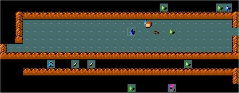</td>
		</tr>
		</table>
		

			I feel as though the tentacles are stretching down the corridor, stopping time and extending towards me.  As the
			beast charges, images flash before my eyes.  I know this nightmare to be a mind flayer, and I see him standing
			over my limp body, his tentacles wrapped firmly around my head.  I see my body alive, but my mind dead.  I
			sheath Magicbane for I know that if I am close enough to use it, my time will already have passed.
		

		

			With both arms pumping I unleash magic missiles directly into the Mind Flayer.  He's fast, but my missiles
			hit their mark.  Without pain or emotion his charge continues.  20 paces.  10 paces.  5 paces.
		

		

			His smoking corpse drops at my feet and I fall against the wall, sweat from exertion, anxiety and fear streams
			down my face.  I use Magicbane to crack open his skull and feast on the brains of the creature, gaining
			knowledge with each bite.  I cannot rest down here though, for there is more exploring to do, and many
			more foes to conquer.
		

	</td>
	<td>
		

			I recommend that you use the same or more caution that I did if you ever encounter a mind flayer.  If he
			gets in close and sucks your brain, your chances of survival drop with each passing moment, even in the unlikely
			event that you survive the encounter.  He can steal your memory of levels and items.  He can steal your spells
			He can steal all that makes you you.  If you're lucky, he'll steal any memories you have of the amulet so
			if you stumble out of the dungeon you won't even be aware of your failure.
		

	</td>
</tr>
<tr>
	<td>
		

			I complete my exploration of the level, but don't come across anything of particular importance.  Notable
			in its absence is a stairway down.  Determined to get to the bottom of things (so to speak), I grab my pick-axe
			and try to dig straight down through the floor.  I find the rock to be much harder than usual for the
			mines and stop after making little progress.
		

		

			If this is to be the end of the mines then, surely there must be more.  I retrace my steps and discover
			two areas that are unexplored, but inaccessible.  In the northwest, I start poking at every wall with my
			pick.  Most are too strong, but finally I feel some give and swing away, breaking through a secret door.
			An etching on the floor indicates that this is the gnome king's wine cellar and warns against trespassing.
			I call out asking if anyone minds if I loot the wine cellar, and hear no response.  This is likely because
			I have eliminated any potential objectors.  I stock up on booze and some unidentified potions and move on.
		

		

			On the other side of the level, I once again find some stone that my pick can penetrate and dig a long
			channel through the rock.  After hours of digging, I emerge in a small chamber filled with gemstones.
			I still have no idea how to tell valuable gems from junk, but I sense this must be the good stuff.  I
			fill my bag with everything that's not nailed down, including a flat gray rock.  It doesn't look like it
			belongs, and that convinces me that it's probably more valuable than the others combined.  Why else
			would it be in here?
		

		

			Finding nothing else to do, I head back up to my camp.  I stop by Izchak's store to thank him for the lamp.
			"Glad you remember me," he says when I stroll up.  I comment that he was right about us meeting again.  He
			pats me on the back, "I know, but I didn't mean this time, you'd best be moving."  And so I did.
		

		

			Back at my camp, I grab Darius' gloves and use a scroll of remove curse to render them safe to wear.
			These offer me better protection than my gauntlets of power, and won't interfere with my spellcasting.
			I keep my gauntlets in my sack so I'll have them if I ever need then.  I have nowhere left to explore,
			save the depths of the main dungeon.
		

	</td>
	<td>
		

			The gem chamber at the bottom of the mines always contains a selection of valuable gems and a luckstone.
			The luckstone, when blessed, will guarantee me good luck for the rest of my travels.
		

	</td>
</tr>
<tr>
	<td>
		

			I navigate my way back to the entrance to the puzzle levels.  This is the deepest I've gone in the main
			dungeon, though the bottom of the mines was actually a little deeper than this.  Nothing along the way
			was able to even make a dent in my defenses, and I stand at the top of the staircase will my maximum
			reserves of magical energy.
		

		

			I go down the staircase.  I immediately come back up.  I can't believe what I just saw.
		

		

			<a href="bigroom.jpg" target="_blank">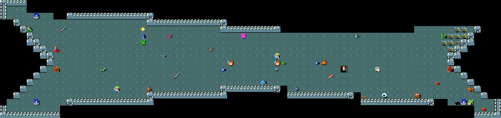</a> 
			Dungeon Level 10
		

		

			I have nowhere else to go though, so I head back down the stairs and let fly with magic missiles.  I
			keep one foot on the bottom stair at all times, in case I need to beat a hasty retreat.  Things aren't as bad
			as they look, and I'm able to relax a little and use Magicbane more, relying on magic missiles only for the
			more dangerous enemies as they approach.  Before I know it, I'm in control of the level and can wander
			around collecting all the items that interest me.
		

	</td>
	<td>
		

			Surprisingly, this big room is known as the "Big Room."  There are two alternative maps for
			this level, this being the more open of the two.  Unlike special levels such as the minetown, this
			level is not always placed in the game.
		

	</td>
</tr>
<tr>
	<td>
		

			On the eastern side of the level, I encounter a pack of gremlins who are thankfully neutral.  They are
			having a ball playing in the fountains on this level, producing duplicate creatures each time they hit
			the water.  Fortunately, the fountains dry up after several splits, so there's only 20 or so gremlins
			running around.
		

		<table class="innertable">
		<tr>
			<td style="width:25%">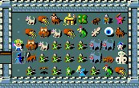</td>
			<td>
				

					Pressing onward, I find that the levels beyond the big room are much like the regular dungeon levels
					above.  I force open a locked door and stumble into another massive treasure chamber.  Though I'm
					right next to an owlbear, I manage to step back into the tunnel.  In the past when fighting owlbears
					they've grappled me and help me in place while I pound away at them.  The only way I've found
					to make them let go is to kill them.
				

			</td>
		</tr>
		</table>
		

			Standing just outside the doorway, I drop a few magic missiles into the room to give the monsters
			inside something to think about.  They charge and I cut them down as fast as I can using Magicbane.
			Through sheer numbers, the creatures manage to deplete my energy and cause severe wounds.  I limp back
			to the staircase, fending off anything that dares follow.  After a short rest a few levels above, I come
			back down and finish the job.
		

		

			Finally after much adventuring, I find that I am significantly burdened by the weight of the items I've
			collected.  I switch from my combat gloves to my gauntlets of power and begin trudging upwards to my
			camp.  I would like to setup my camp further down in the dungeon, but thus far I have not found a suitable
			location.
		

	</td>
	<td>
		

			There are several treasure chamber type rooms you will encounter.  This is known as a treasure zoo.  I've
			already seen a throne room in this adventure.  There are other types as well such as a bee's nest and a
			chamber filled entirely with gold and leprechauns.
			  
			Though you sometimes get some items from a treasure chamber like this, the main reward is lots
			of gold and experience.
		

	</td>
</tr>
<tr>
	<td>
		

			I fill my box with loot and grab all the items I have yet to touch to the altar.  I also grab a couple
			of potions I've identified as useless to me.  I have 11 potions total, 6 potions of booze from the
			gnome king's wine cellar and 5 potions of object detection.  I grab all my cash also - well over 10,000
			pieces of gold.  The biggest prizes are a pair of spellbooks I have yet to read.
		

		

			I return to a fountain on the entry level of the dungeon and dip my potions into it.  After a couple of
			cold-water baths, my potion bottles contain merely water instead of their magical concoctions.  As I finish,
			the fountain slows to a trickle, then stops.  I've seen several other fountains spread throughout the
			dungeon; I'll have to use one of those if I decide to repeat the process.
		

		

			Down in the minetown temple, I determine that neither spellbook is cursed, so I read them both and gain
			knowledge of drain life and levitation.  I place my bottles of water on the altar and pray to Anhur to
			bless them, which he does.  He also blesses Magicbane for me, so I know he must be pleased with my
			progress.  I donate most of my gold again to the priest and he blesses me with additional protection.  I
			grow weary of all the travel, but I head back to my basecamp once again to examine my combined inventory.
		

	</td>
	<td>
		

			Here I describe the process of creating holy water.  Holy water can remove curses or bestow blessings.
			It also can be used to harm undead creatures.  Once I have an initial supply, I can create additional
			potions of holy water by <b>dipping</b> regular water into holy water.
		

	</td>
</tr>
<tr>
	<td>
		

			Using the holy water Anhur created for me, I'm able to bestow blessings on any items I choose.  I experiment
			a little and determine that a cursed items requires two holy water baths to become blessed.  Digging through
			my chest, I emerge with a scroll of remove curse.  I bless the scroll to imbue it with greater power and
			collect all of my cursed items into one giant pile.  The scroll renders them all safe, or at least neutral.
		

		

			I don't have any spare identify scrolls, but I'm so familiar with that incantation that I'm able to produce
			my own scrolls using Darius' magic marker and the blank paper I got from a paper golem.  I identify an
			assortment of gear and strike paydirt.
		

		

			In my most recent travels, I've managed to find rings of teleport control, levitation and conflict.  Rings,
			in general, are the most convenient enchanted items to use, and these three will be key elements of my
			success if I'm able to recover the amulet.  I also have finally discovered a scroll of enchant weapon which
			I bless and use on Magicbane.
		

	</td>
	<td>
		

			Once you have identified a certain type of scroll, you can make additional copies so long as you have
			a magic marker with enough charges and some blank paper.  The same goes for spellbooks, but identifying
			a scroll will not enable you to write a spellbook.  The two forms of magic are completely separate.
		

	</td>
</tr>
<tr>
	<td>
		

			As I look upon the final scroll, a shiver runs through me for I hold the lives of countless creatures
			in my hands.  A silence fills the dungeon as its denizens sense that now would be a bad time to remind
			me of their presence.  I bless the scroll to grant it its maximum power and read...
		

		What class of monsters do you wish to genocide
		

			I realize this is not something to be taken lightly, so I make an attempt to recount my adventure to
			determine what I most fear.  Unfortunately, whatever I imagine though becomes twisted and covered with
			purple tentacles.  I know it's rash, but I must do it.  I whisper the name of my nemesis.
		

		Mind Flayers
		

			Sadly, the scroll is unable to remove them from my nightmares as well.  I'll have to be content with the
			knowledge that I shall see no more of those tentacled beasts during this journey or any other.
		

		

			I bless a few more items, including my unicorn horn, and turn my attention to an
			enchanted helm I found very early in my descent.  I've ignored it to this point because
			it was cursed, but now, armed with a supply of holy water, I decide to identify it and
			see if I might put it to use.  An identify scroll reveals it to be a -5 helm of
			brilliance.  Potentially valuable, this item would have crippled me had I worn
			it earlier as it has the power to increase or decrease the intelligence of the
			wearer, in addition to its standard protective properties.
		

		

			I lack the quantity of scrolls required to make this item usable at this time,
			but I seem to recall seeing a similar helm in a store far below.  After a short trip
			I return with the other helm and determine that it is uncursed and +0.  I read my
			final scroll of enchant armor to increase it to +2 and slip it onto my head.
		

		

			I feel powerful, but not invincible.  I return to the depths with confidence and
			caution at the same time.
		

	</td>
	<td>
		

			In earlier versions of NetHack, you had to type the "letter" of a class in order to class genocide it.  For
			mind flayers, that letter is h.  You would really only know this if you had played a version of NetHack
			without the graphical tiles.  Regular genocide performs a couple keyword matching schemes to let you
			specify a creature by name.
			  
			I wrote a patch to the game which added the keyword matching to the class genocide routine.  Unfortunately
			the keywords aren't properly configured for mind flayers.  You still have to class genocide "h".  It works
			for most other nasty creatures that you would want to consider genociding though.
		

	</td>
</tr>
<tr>
	<td>
		<a name="quest"><h1>The Quest</h1></a>
		

			My descent is uneventful, and I emerge on level 15 of the dungeon.  I become instantly
			aware of a telepathic message sent by my teacher, Neferet the Green.
		

		

			Your help is urgently needed at the Lonely Tower!  Look for a ...ic transporter
		

		

			I am wary of this call for help.  It could be an imposter or some other means to
			divert my attention from the amulet I seek.  Still, there is something familiar
			in the tone, and I choose not to risk offending my mentor.  After a short trip
			around the dungeon chambers, I manage to find the transporter described to me.
		

		

			You are suddenly in familiar surroundings.  You notice what appears to
			be a large, squat stone structure nearby.  Wait!  That looks like the
			tower of your former teacher, Neferet the Green.
			  
			However, things are not the same as when you were last here.  Mists and
			areas of unexplained darkness surround the tower.  There is movement in
			the shadows.
			  
			Your teacher would never allow such unaesthetic forms to surround the
			tower...  unless something were dreadfully wrong!
		

		

			All sorts of vile creatures surround Neferet's tower, mostly of the undead variety.
			Dozens of vampire bats fall.  Shades, wraiths and the like follow.  As I approach the
			tower walls, they animate and Xorns march towards me.  They slow my approach, but
			otherwise accomplish nothing and soon none stand against me.
		

		

			<a href="quest.jpg" target="_blank">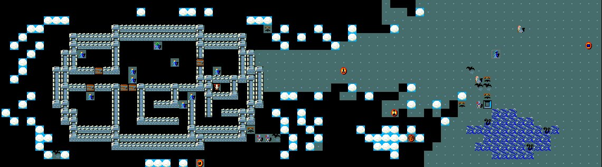</a> 
			Wizard Quest Entrance
		

	</td>
	<td>
		

			Each role in NetHack has a unique quest they must complete in order to win the game.
			The telepathic message and entrance is more or less the same for all, but once I
			pass through the transporter, I am on the Wizard's quest.  Other characters will
			encounter different levels with a different goal.
		

		 
		

			Unlike most of the other branches in the dungeon (like the mines or Sokoban), all
			characters <i>must</i> complete the quest if they are to win the game.
		

	</td>
</tr>
<tr>
	<td>
		

			Neferet is expecting me of course, but stops me to assess my abilities and dedication.  He needs
			my help but does not want to send me on a futile mission I am incapable of completing or
			send a minion who is not dedicated to the cause.
		

		

			"Yes, Artius, you truly are ready for this dire task.  Listen,
			carefully, for what I tell you now will be of vital importance.
			  
			"Since you left us to hone your skills in the world, we unexpectedly came
			under attack by the forces of the Dark One.  As you know, we thought
			the Dark One had perished at the end of the last age, but, alas, this was
			not the case.
			  
			"The Dark One sent an army of abominations against us.  Among them was a
			minion, mindless and ensorcelled, and thus, in the confusion, it was able
			to penetrate our defenses.  Alas, this creature has stolen
			the Eye of the Aethiopica and I fear it has delivered the Eye of the Aethiopica
			to the Dark One.
			  
			"Over the years, I had woven most of my power into this amulet, and thus,
			without it, I have but a shadow of my former power, and I fear that I
			shall soon perish.
			  
			"You must travel to the Tower of Darkness, and within its dungeons,
			find and overcome the Dark One, and return the Eye of the Aethiopica to me.
			  
			"Go now, with Anhur, and complete this quest before it is too late."
		

		

			With Neferet's blessing, I descend into the dungeon beneath his tower.  These chambers
			are nearly identical to those found in the Dungeons of Doom, but here they are
			infested with vampire bats, dragons, xorn, tengu and the like.  The going is slow
			but I come across many scrolls I have not previously encountered, and add them to
			my collection.
		

	</td>
	<td>
		

			You must be at least level 14 and in the good graces of your God in order to get past
			the quest entrance.  I was level 13 when I entered, but I killed a wraith and ate
			the corpse.  Eating a wraith corpse will cause you to gain a level instantly.
		

	</td>
</tr>
<tr>
	<td>
		

			I soon arrive outside another tower, similar to Neferet's but darker. Once again
			I am forced to find a secret entrance, then another.  When I finally penetrate the
			inner defenses, I sense that I am close to the Eye I seek.  I have picked up a pair
			of enchanted boots along the way, and I immediately use a spare identify scroll on
			them, revealing them to be +2 boots of speed.  I cannot remove my jumping boots fast
			enough and the rest of the world appears to slow down as I slip my new prize onto my feet.
		

		

			At the bottom of the dark tower, I sense that the end of my quest is at hand.  I
			charge through the Dark One's defenses and arrive at the doorstep to his private
			chapel.  I throw a bunch of items into the corner so I can move unimpeded as I take
			on my nemesis.  I won't need them during the fight, and if I'm unable to collect them
			later I'm guessing that that will be the least of my worries.
		

		<table class="innertable">
		<tr>
			<td style="width:25%">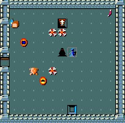</td>
			<td>
				

					I charge in, Magicbane gleaming and magic missiles firing from my fingertips.  The
					Dark One taunts me, then disappears.  I'm blindsided with a ferocious blow and realize
					that among the items I discarded were some potions of see invisible.  I swing wildly
					in the direction I sense the attacks are coming from and connect once or twice.  When
					the Dark One backs off, I apply my blindfold and hunt him telepathically.  We continue
					our duel all over the confines of his dungeon, leaving scorch marks on many a wall
					as well as a few innocent bystanders.
				

			</td>
		</tr>
		</table>
		

			He makes a break for the stairs, but with my boots of speed I'm able to beat him to
			his destination and I make my stand there.  Magicbane feeds off my thirst for victory
			and with a series of blows I steal the life of my enemy.  The Dark One falls, and I
			collect all that was his.  The Eye is mine for now, but I promised to return it
			to Neferet.  I also find a silver bell and a wand of sleep.  I try
			to stuff everything in my bag, but somehow the silver bell
			refuses to allow itself to be placed within.  The Eye is what I sought, but
			I sense that the bell is perhaps more powerful still.
		

	</td>
	<td>
		

			The speed conveyed by boots of speed is greater than any other speed enhancement
			available in the game.  No amount of enchantments will produce a similar effect.  Regardless
			of role or playing style, the boots of speed are always the best footwear in the game.
		

	</td>
</tr>
<tr>
	<td>
		

			The burden of the items I've collected is offset by my boots of speed and before I
			know it, I'm standing before Neferet again.  He thanks me for handling the Dark One
			and rewards me with the Eye I recovered.  I was going to ask for it anyway, for I'll need
			all the help I can get if I'm going to recover the Amulet of Yendor.  Neferet said
			as much when he handed the Eye back to me.
		

		

			Needing a rest from my adventure, I equip my gauntlets of power and begin the process
			or relocating my hoard of items from the second level of the dungeon to the fifteenth.
			I'm able to do this in only two trips and though I left some items behind, I didn't
			have any interest in them.  They will be safe in my old camp if I ever decide to return.
		

		

			In my trips back and forth, I encounter a winged gargoyle and strike it down with two
			blows from Magicbane.  As he falls though, his amulet casts a glow over his body
			and he is restored and continues the fight.  When I dispatch him a second time, he
			falls for good.  I wish that I had been able to recover that amulet, but it was
			consumed during the fight.  I'll be sure to keep my eye out for anything that looks
			even remotely like it in the future.
		

		

			I'd like to be a lot more varied in my spell selection, but thus far just haven't
			come across spellbooks to my liking.  I set out to change this and rifle through
			my collection, looking for books that I've read, but never truly used.  I grab books
			of cure sickness and cure blindness.  My unicorn horn provides me with those benefits
			(and more) already.  I grab my book of haste self, for my boots of speed already
			make me faster than that spell ever could.  I grab a book of levitation, for I have
			a ring to provide me with that power.  Finally I grab a spellbook of confuse monster
			because anything that would fall under that spell's power can be more easily dispatched
			by Magicbane.
		

	</td>
	<td>
		

			The Eye of the Aethiopica is known as the wizard's <i>quest artifact</i>.  Each role
			in NetHack has a different prize awaiting them at the end of their quest.
		

		 
		

			The Silver Bell of Opening is an object that is required later in the game to enter
			the Amulet's hiding place.  NetHack goes out of its way to prevent you from destroying
			the bell, so just make sure you don't lose it.
		

	</td>
</tr>
<tr>
	<td>
		

			I place all of these books in a line along the floor of my new camp and draw my
			wand of polymorph from the folds of my cloak.  Though these books themselves have
			done me no good thus far, perhaps they can be turned into something that will.  I have
			four charges in my wand of polymorph and I feel confident that some good will come
			of this.  With my first casting, one book is destroyed and one morphs into another
			book of haste self.  The other tree however are turned into spellbooks I've never seen
			before, so I sit down to read them.  I have produced spellbooks of light, healing
			and extra healing.  Not too shabby, but not exactly what I was looking for.
		

		

			I decide to try again with the spellbook of healing.  That spell is for less
			powerful characters than myself, so I doubt it will be useful to me.  I line up
			four more books and try again.  I gain spellbooks of restore ability and stone to
			flesh.  If I was a healer of a priest, I'd be ecstatic, but I am a Wizard and these
			do not help me.  I line them up and try again.
		

		

			Knock, charm monster and remove curse.  Charm monster will allow me to recruit pets
			much easier than before,  It would have been more helpful earlier than it is now, but
			all things being equal, I'm happy to have it.  Knock is not particularly useful to
			anyone with a skeleton key like the one I found in the mines.  Remove curse is a nice spell to have, though
			I feel that I probably have enough scrolls of remove curse to not need it.  I only
			get one more try at this, for my wand is about to run out.
		

		

			My final attempt grants me spellbooks of identify and cause fear.  Identify is one
			of the spells I had most wanted, and I rejoice at my good fortune.  My wand of
			polymorph is spent, but I keep it anyway with my other items as with the proper
			enchantment, I might be able to recharge it later.  I set out to use my new spell
			to identify everything in my collection.  I lock the doors and set out an ample
			food supply, for I anticipate being in my camp for quite some time.
		

	</td>
	<td>
		

			Polymorphing several objects at once like this is a technique known as <i>polypiling</i>.
			You can either line the objects up in a row or put them all on the same square.	 In older
			versions of NetHack, this was an abusive technique, but now your chances of getting
			quality items goes down as the number of items goes up.  In addition, items can be
			destroyed or can rise as golems from time to time.  The nature of an object never changes
			so a spellbook will always morph into another spellbook, a weapon into another weapon.
		

	</td>
</tr>
<tr>
	<td>
		

			Hours later, All of my questions are answered.  None of my stashed loot was as powerful
			or useful as my boots of speed or spellbook of identify, but as a whole, it was
			a very nice collection.  I took all of my useless or redundant scrolls and potions.  Things
			like a scroll of teleport are useless when you have a wand with 15 charges.  I take
			these back to the edge of the lake outside Neferet's tower.
		

		

			I place all of my metal objects such as my rings and my pick-axe in a pile and approach the
			water.  As I prepare to enter the water I notice an odd shimmer to the water and jump back.
			My telepathy confirms that giant sea serpents occupy this pool, and I am lucky to have
			noticed for had one of them ensnared me, they might have dragged me under the water to
			my death.  From the safety of the shore, I launch magic missiles into the water until
			I have removed the creatures.  Convinced it is safe, I wade in and  fill all of the
			potion vials with water and carefully soak the scrolls until the writing has
			completely faded.  On my way back to my camp, I realize I had forgotten to remove my
			helm of brilliance and it is now completely rusted.
		

		

			I combine my vials of water with the holy water Anhur created for me in the minetown
			and soon have over 30 vials at my disposal.  I bless all of my remaining potions and quaff
			a few.  I feel healthier than I ever have before, and more powerful too, so I continue
			drinking until I have no more potions left.
		

		

			I then turn my attention to my scrolls and find that the
			only ones I am interested in using right now are the ones
			to enchant my armor.  I rustproof my helm of brilliance,
			erasing the damage I inflicted on it while swimming and then enchant it and
			various other items in my collection.  I put on an enchanted
			T-shirt under my leather armor and switch to a pair of
			enchanted gloves of dexterity, putting Darius' gloves back
			into my box of items.  After all of this, I feel almost
			unstoppable!
		

		

			Artius the Enchanter St:18 Dx:23 Co:16 In:22 Wi:19 Ch:12 Chaotic 
			Dlvl:15 $:0  HP:139(139) Pw:215(215) AC:-22 Exp:15 T:44371
		

		

			As I break camp, I walk right into an ambush skillfully laid by
			a stone giant.  He fires off a couple of shots from a wand of death
			but they miss.  I'm sure that my amulet of reflection would have
			saved me anyway and I close in with Magicbane.  Soon the wand is mine.
		

		

			Now that I possess such a large collection of tools to aid me
			in my adventure, my luck changes.  I almost immediately
			come across a lamp which my identify spell reveals as a magic lamp.
			If it's as powerful as I hope it is, it must surely be the best item I've found
			in the dungeon so far.  For now though, I use it only as a light source as I
			feel comfortable that I have satisfied my needs for now.
		

	</td>
	<td>
		

			All scrolls, potions and spellbooks are potentially valuable as they can be blanked
			by dipping them in water, or swimming as I do here.  Swimming has many severe hazards
			when compared to <b>dipping</b> items in a fountain, but fountains have a limit while
			swimming does not.
			  
			Unimportant portions can be converted to holy water, as I do here.  Scrolls and spellbooks
			can be erased and later rewritten using a magic marker.
		

		 
		

			You can levitate over a pool of water and <b>dip</b> items into it.  This way you can
			get many of the benefits of swimming with items without exposing yourself to the
			most significant risks.
		

	</td>
</tr>
<tr>
	<td colspan="2">
</td>
</tr>
<tr>
	<td>
		<a name="medusa"><h1>Medusa and Beyond</h1></a>
		

			Lulled into a false sense of security, disaster strikes.  A nymph approaches me
			and convinces me to remove my boots of speed.  Right as I hand them over,
			the nymph vanishes.  I don't know what I was thinking, but she seemed trustworthy at
			the time.  My telepathy reveals that she is clear across the level, so I
			carefully begin the hunt for my tormentor.  The level is very wet, for lack of a
			better word.  There is water and mud all over the place, and more giant eels await me.
			I again use my telepathy to fight them from a distance, then use my pick-axe to dig
			around the flooded rooms so that I don't accidentally fall in.  Barefoot and angry I
			finally confront the thief with a flurry of magic missiles and regain my prized
			boots.
		

		

			Armed with an almost limitless supply of identify spells, I
			scrutinize every item in my path as I continue downward.  I come
			across a ring of slow digestion which I instantly wear.  I've
			been weighed down by my food supply, but with this ring I'm able
			to toss my foodstuffs away.
		

		

			A titan guards a large chamber deep in the dungeon and he
			summons a hoard of allies as I enter.  I stay close to the
			staircase and defeat the creatures one by one.  My enchanted
			armor provides me with greater defenses than the enemies
			can penetrate.  I've noticed that ever since I carried the Eye
			with me, my magical power has regenerated far faster than
			before.  I can cast my spells almost recklessly without risking
			my safety.
		

		

			Outside the chamber I see small islands separated by a huge
			expanse of water.  Eels, fish and other sea creatures lurk
			under the water.  Though not with the same precision as with my telepathy, I'm find
			that I'm now able to sense nearby dangers.  I'm not sure when I was imbued with this
			power, but it allows me to know that something lurks nearby in the water.
			I fire magic missiles at the targets until they are no more.
		

		

			Sliding my ring of levitation on, I move from island to island
			slaying whatever lies there.  On the eastern shore, I come across
			a small castle.  I slay everything in sight, but one pesky
			troll rises from the dead every time I kill him.  After
			Magicbane steals his life for the 4th time, I slip on my
			gauntlets of power and use my increased strength to throw his
			corpse into the water.  Whatever fate awaits the troll, I'm confident
			that he now has far better challenges to focus on than my invasion
			of his home.
		

	</td>
	<td>
		

			Nymphs are fairly common in NetHack and can appear even in the early levels.  Depending
			on what they steal, they can be either an irritation or a significant threat.  If
			possible, kill them before they get in close enough to steal anything.
		

	</td>
</tr>
<tr>
	<td>
		<table class="innertable">
		<tr>
			<td>
				

					The castle is filled with statues unlike those I have seen
					in the dungeon.  Lifelike statues.  Lifelike statues of creatures that
					all show similar signs of fright and terror.  I wear my blindfold
					and reach out with my telepathy and find the owner of this castle deep within.
					Swirling tentacles reach out from her head, and I flashback to my encounter
					in the mines with the mind flayer.
				

			</td>
			<td style="width:25%">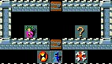</td>
		</tr>
		</table>
		

			I look through my bag to see if I carry any more scrolls of genocide but catch myself
			realizing that I must be mistaken.  Examining the creature more carefully, I determine
			that the tendrils are snakes, not tentacles.  I have stumbled into the lair of Medusa
			the gorgon, a creature who's very gaze will turn a man to stone.  I'm certain that it
			would turn a woman to stone as well, but the legend I heard didn't specify.
		

		

			Fortunately, the legend shares the secret to defeating
			a gorgon as well.  Armed with my telepathy, I'm able to continue
			blindfolded into the inner chamber.  I rush in and swing
			Magicbane, attempting to behead the beast, but I hit rock
			and send a stinger up my arm.  Removing the blindfold I find
			that I've just attacked a statue of medusa and conclude that
			my amulet of reflection has done my dirty work for me.
		

		

			The dungeon below is mazelike, but I easily find my way by
			methodically traversing every possible route until I find
			the staircase down.  The tight passages make it difficult for
			my enemies to engage me in numbers, and they fall quickly to my
			might.
		

		

			Soon I stand before an immense castle, large than any I have seen
			before.  It is surrounded by a moat and drawbridge and telepathy
			reveals hundreds of terrors within.  I start to work on the drawbridge
			with a wand of striking and it is quickly destroyed.  I then
			stand for hours, pumping magic missiles through the gateway
			until I can't see past the corpses on the other side.  I levitate
			over the moat and vomit from the stench.
		

	</td>
	<td>
		

			There are several ways to dispatch Medusa, but they all involve blinding yourself
			first.  Blindness combined with reflection is far an away the easiest way to
			survive this encounter.
		

		 
		

			Medusa's chamber always contains a statue of Perseus which can be broken with a
			pick-axe or force bolt to reveal a treasure.  It is either a boots of levitation
			or a shield of reflection and is usually cursed.
		

	</td>
</tr>
<tr>
	<td>
		

			I explore as much as I dare, proceeding past each locked door with
			caution, careful to never expose myself to more foes than I can handle.
			I find treasure, some still in the hands of my enemies, others lying
			in giant treasure vaults.  I set out to identify
			the treasure hoard and systematically separate the wheat from the chaff.
			One wand demands that I cast identify on it multiple times.  Each time
			it is revealed to me as a wand of wishing.  This can't be right, so I
			stash the wand for later examination.  I'm certain this is
			a carefully laid trick created by my enemies to destroy me.
		

		<table class="innertable">
		<tr>
			<td style="width:25%">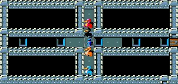</td>
			<td>
				

					I levitate over some deep pits.  A foul warm air emanates from them
					and I gag and move on.  I can't see how far they go down, and I'm
					not sure I'd want to see the bottom anyway.  I turn a corner and encounter
					dragons, four to be exact.  Each dragon is a different color
					and attack me with claw, beak and breath.  Orange, silver, red and
					black dragons move in and surround me, hurting me, killing me.  I put my wand
					of death to use and strike them down.
				

			</td>
		</tr>
		</table>
		

			The silver dragon defies my wand though, his scales reflect the bolt back at me,
			causing my amulet to reflect it back at him ad naseum.
			I step aside and allow the death bolt to hit the wall behind me.  Facing
			just the single dragon though, I'm able to use my speed and put
			some separation between us.  I quaff a healing potion and move in
			with Magicbane.  I enjoy a fine meal of silver dragon meat, and carve
			off his hide using Magicbane.  Me leather armor bears too many
			marks of combat, and I will feel better protected by his scales
			than I do using just my amulet of reflection.  I'm burdened by the
			bounty of treasure I've collected, so I slowly head back
			to my basecamp.
		

	</td>
	<td>
		

			The castle lies at the bottom of the Dungeons of Doom.  Don't worry though, there
			is plenty to be found below it.  Completing the castle represents a significant
			milestone in the game and usually indicates that you are well-prepared to attempt
			to recover the Amulet itself.
		

	</td>
</tr>
<tr>
	<td>
		

			I forget to wear my ring of levitation though, and fall into
			the deep pits I'd crossed before, arriving in the valley
			of the dead - quite literally the gates of hell.  I am surrounded
			by nightmares, shades and zombies.  Slowly, I carve a path towards a
			small cave where I can fight with my back to a wall.  The
			undead attackers move slowly and soon I've created a small buffer
			through liberal application of magic missiles.
		

		

			A vampire lord reads a scroll of create monster and I am beset again.
			My buffer destroyed, and caught out in the open, I'm still able to
			fend off the onslaught.  I move and fight, trying to stay ahead
			of the tidal wave of claws, fangs and steel.
        

		

			I see the bodies of fallen adventurers everywhere.  I do not
			know if they fell here, or were carried by daemons and the like.
			Ghosts come through the walls to attack me, but my blade is far too
			fast for them, my power to great.  I am shocked to be attacked by
			a ghost bearing my name and likeness.  Undoubtedly another
			trick designed to torment me, I can't help but wonder if the encounter
			has foreshadowed my own end.
		

		

			I don't feel ready to be here though, and were it not for my
			missteps above in the castle I would not be.  More creatures approach
			but I can't see them with my telepathy, I can only hear
			the footsteps and detect them with my other senses.  I head away from the
			footsteps and soon find a staircase leading up.  Using it, I'm able
			to return to the castle, but the stairs seal themselves upon
			my arrival and I can't return that way even if I wanted to.
		

		

			I know I'll be back here soon, so I don't give it a second though.
			The stench of death lingers about me, even as I climb level
			after level.  Most denizens of the dungeon avoid me, sensing my power.
			Those that do not fall quickly and serve as a further example
			to the others.
		

	</td>
	<td>
		

			The Valley of the Dead is a small buffer between the Dungeons of Doom and Gehennom.
			It offers a glimpse of what lies ahead.  If you have any trouble surviving in the
			valley, it is best to head up rather than down.
		

	</td>
</tr>
<tr>
	<td>
		

			Back in the safety of my camp, I lock the doors and once again
			sift through my box of treasures.  I start with the wand of wishing.
			Giving myself plenty of room, I close my eyes and invoke the wand
			using both hands.  Though I'd never come across another amulet like the one
			that temporarily saved the 	gargoyle, I knew exactly what it looked like.
			I formed a clear image in my mind.
		

		For what do you wish?
		Amulet of life saving
		

			And there it was.  Wow.  I take off the amulet of reflection that I'd found
			far above in the puzzle levels and wear the amulet of life saving instead.  I try
			to use the wand of wishing again, but nothing happens.  I commit to playing more with
			it later, and set it aside for now.  I whip out my magic markers and paper now and
			write a pile of enchant armor scrolls.  When I enchant my silver dragon scales, they
			morph and form a tight shield around my body.  The scales now feel almost as light
			as my leather armor, but I know them to be far harder and provide my with the
			silver dragon's reflective powers.
		

		

			I enchant everything as fully as I dare and soon am covered in armor shimmering
			with magic.  I even wear an enchanted T-shirt under my silver dragon scales.  My helm
			of brilliance and gauntlets of dexterity make me smarter and more agile.  My boots
			make me faster.  In the back of my mind, I sense that I am still vulnerable, but I'm
			not sure to what.  I must be vigilantly on the lookout for new threats, but I doubt
			that anything I've already defeated can even touch me now.
		

		

			I have a scroll of charging, and I use it now on my wand of polymorph, filling it with
			8 new charges.  I have a mountain of redundant spellbooks now, still haven't found
			the full complement of spells I desire.  Over and over I polymorph my spellbooks
			and read the new pages, learning spell after spell.  When I've run out of charges
			in my wand, I am most pleased with my knowledge of fireball and finger of death.  If
			overconfidence kills, then I fear I have one foot in the grave.
		

		

			As I'm dumping my remaining spellbooks back into my treasure box, an idea forms in my
			mind.  I grab my magic marker and a blessed blank paper.  Writing carefully, I
			produce another scroll of charging and recharge my wand of wishing.  I am now
			the proud owner of 3 new wishes and I instantly wish for a bag of holding and a
			spellbook of magic mapping.  I could have wished for items of greater power, but these
			were two things that I needed and wanted.  I'm not expert on items of power, and I'm
			already equipped with items far more powerful than I ever imagined.  I'm not sure
			what I would have wished for had I wanted to be less conservative with my wand.  Of course, I knew
			that the minute I wished for these items, I was ensuring that I would find duplicates in
			the near future.  Probably some daemon is watching me now as I state my wishes so that
			he might conspire with his overlords to create these very items and lay them in my
			path.  Knowing that few forces can stop me physically, their only recourse is to drive
			me to insanity.
		

		

			You can wish for any item in the game that you can carry in your inventory, with
			a few restrictions.  Certain items, such as the silver Bell of Opening I carry and
			the Amulet of Yendor can never be wished for.  Certain other items, such as Magicbane
			have a percentage chance of appearing if you wish for them.  You can never wish for
			magic lamps or wands of wishing of course, because that would just be stupid and NetHack
			is never stupid.
			  
			So, this begs the question "what should I wish for?"  There are, of course, spoiler
			files on the Internet which answer this very question, but here are some tips: 
			1. Dragon scale mail is the best armor in the game in terms of protection (it comes in
			as many colors as dragons do. That's usually the best thing to go for with a first wish
			unless you already have the color armor you want.  Gray dragon scale mail grants magic
			resistance and silver dragon scale mail grants reflection. 
			2. Magic resistance and reflection are the two most helpful defensive powers
			in NetHack.  Whichever one you don't already have from your dragon scale mail you can
			wish for with a cloak of magic resistance or a shield or amulet of reflection. 
			3. Boots of speed are helpful for any character. 
			4. Always wish for blessed items, you will always get them.  If you don't specify
			you will most likely get an uncursed version. 
			5. If you wish for +2 items, you'll usually get them, the higher you specify, the
			lower the chance of receiving the enchantment level.  If you wish for +5 for instance, you'll almost
			always get +0 instead. 
		

		

			I bless all of my items, select just what I need, and head back down to the castle leaving
			most of my treasure behind for there is only one prize that I seek.
		

		

			Artius the Sorcerer St:18 Dx:23 Co:16 In:22 Wi:19 Ch:12 Chaotic 
			Dlvl:15 $:0  HP:195(195) Pw:312(312) AC:-40 Exp:18 T:57425
		

	</td>
	<td>
		

			There are many ways to receive wishes in NetHack, the two most obvious being a wand
			of wishing and a magic lamp.  It is possible to complete the game without using any
			wishes, and many people do so by intentionally avoiding wishes like the plague.  In
			this game, I actually didn't need to use any wishes, but did so both to demonstrate
			the feature and to close the minor gaps in my character.  I'd hate to come so far
			both in the game and in this report only to fall short.
		

	</td>
</tr>
<tr>
	<td colspan="2">
</td>
</tr>
<tr>
	<td>
		<a name="gehennom"><h1>Gehennom</h1></a>
		

			In the castle, I intentionally jump down a pit and arrive again in the valley of the dead.
			I don't know if it's because I haven't killed anything recently or not, but it's fairly
			silent down here this time.  Exploring more deliberately, I find pockets
			of evil, but dispatch them quickly.  About 200 steps from the stairs
			in the valley of death, I find a spellbook of magic missile.  "Touche," I remark
			and nod my head to my unseen tormentor.  "Well played."
		

		

			It's all the same everywhere I turn.  Bodies, some animated, are piled
			everywhere I turn.  Gravestones, ash piles, ghosts.  There is no fear
			here in the Valley of Death, something worse.  Despair, resignation.  My path
			leads to a temple of Moloch.  Moloch, the God of the dead.  Moloch,
			outcast and thief.  Moloch, current owner of the Amulet of Yendor.  The priest of the temple is neither
			cordial nor unpleasant.  If he worships death though, he should bow to
			me for I have brought it to his doorstep.
		

	</td>
</tr>
<tr>
	<td>
		<table class="innertable">
		<tr>
			<td>
				

					I briefly consider dispatching the priest and defiling the shrine,
					or even converting it to worship Anhur.  The priest might have
					unknown powers though, and if Moloch protects him the way that
					Anhur protects me, I could be in for more trouble than I can handle.
					Thoughts flood me, from where I do not know.  It could be the priest
					or Anhur or Moloch or all three.  I know that I will eventually have to
					defy Moloch if I am to succeed in my quest, but that time has not yet come.
				

				

					A hidden panel in the back of the temple leads to a stair.  The Valley
					of the Dead is technically within the boundaries of the world of the living.
					When I emerge at the bottom of the stairs though, I know that I am no longer
					in that world.
				

			</td>
			<td style="width:25%">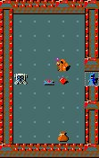</td>
		</tr>
		</table>
		

			I have entered Gehennom, the world of suffering.  Here there
			are no boundaries between the living and the dead, only boundaries between
			those that belong and those that do not.  There is nothing I can do to draw
			more attention to myself than I have simply by entering. I use my magic mapping
			spell to reveal a gigantic maze.  I see the staircase
			nearby and set out with my pick-axe to cut a direct path.  In the world of the
			living, I was a force unmatched.  Now though, I know that if I decide to
			turn back, I will need to do so with much haste.  I won't have time for
			mazes and puzzles.
		

		

			Soon I find a fortress carved into the very walls of Hell, and enter
			willingly.  I move quickly, fighting only when necessary.  I ignore most
			items that tempt me, knowing them to be just that.  There is only one
			treasure I seek, and I know that it will not be lying about on the
			floors of the maze.
		

	</td>
	<td>
		

			At this point, I could probably defeat this priest, but why pick fights unnecessarily?
		

	</td>
</tr>
<tr>
	<td>
		

			Inside the fortress, I'm forced to do battle with daemons.  A pit fiend
			uses his whip to steal Magicbane from me, but before my ally can be turned
			against me, the fiend is destroyed with a massive fireball.  I reclaim my
			blade and proceed to the inner chambers.  The arch-daemon Asmodeus appears
			and demands that I forfeit all of my gold to buy safe passage from him.  He
			seems to welcome an attack, but I had long ago decided to leave all my
			gold behind so as to not weight myself down.  I have only 500 gold pieces
			with me, which I happily turn over.  He disappears and I hope that I
			never see him again for he might become emboldened by my cowardice.
		

		

			Continuing downward, I soon encounter a giant swamp.  I immediately
			levitate and use my magic mapping and telepathy to determine
			the best course of action.  In the middle of the swamp, I see a pulsing
			pile of innards.  It's almost as though a giant stomach has been ejected
			from its host.   I levitate to explore the swamp and before I know it
			the stomach appears around me and inflicts a terrible illness on me.
			I have stumbled across the arch-daemon Juiblex and I am overcome with
			fear, sickness, and despair.  I release my bowels and the aroma within Juiblex
			improves.
		

		<table class="innertable">
		<tr>
			<td>
				

					My blessed unicorn horn is able to stave off the effects of
					my affliction, and I'm tempted to plunge it into the sidewalls of the daemon.
					I think better of it at the last moment though.  The unicorn horn is my only
					defense against Juiblex's powers and it is more valuable to me in that capacity
					than it would be as a weapon.
				

			</td>
			<td style="width:25%">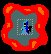</td>
		</tr>
		</table>
		

			I touch him with my finger of death, but he is
			unaffected.  I hack with Magicbane, stopping only to draw from the regenerative
			powers of my unicorn horn.  Juiblex falls as I cut my way out of him, and
			I crawl back upstairs, vomiting.  With Juiblex gone though,
			the swamp poses no threat to me, and when I return I easily move through and down to the
			lower reaches of Gehennom.
		

		

			Again I see an inner fortress within the maze as I cast magic mapping.
			Again I enter.  This time, Baalzebub demands 245 gold pieces for safe
			passage and I comply.  I wonder if perhaps there is something that these
			arch-daemons know that I do not, for I do not feel as though their demands
			unreasonable.  I wonder what he will do with the money as I continue downwards.
		

		

			I am now 35 levels below the entrance
			to the dungeons of doom.  Power courses through me veins and I find
			that armed with the Eye, I am able to cast finger of death with the
			regularity that I used to reserve for magic missile.  It has no effect
			on creatures that are already dead, such as vampires, but it chews
			through everything else instantly.  I carve routes through maze after
			maze with my pick-axe.
		

	</td>
	<td>
		

			Asmodeus calls me a coward as he takes my money.  I agree, this is a very cowardly
			move on my part.  Things can go from good to bad in a hurry down here, and while my
			character is strong, you are always vulnerable to the special abilities of the
			most powerful enemies.
			  
			Were I not playing this game for the purposes of generating this report, I might be
			more aggressive.  Along these same lines, I have decided not to carry any significant
			quantities of gold and gemstones with me.  These would increase my score, but I'm
			simply not interested in that.
		

	</td>
</tr>
<tr>
	<td>
		

			38 levels below, my magic map reveals a town much like minetown.  I doubt
			very much that my experience here will be as beneficial.  The shops are
			abandoned, but filled with items.  My hopes are dashed though, as most of
			the items end up being mimics instead.  The temple is aligned only with Moloch,
			and there is no priest inside.  Creatures are everywhere, but all who approach
			me quickly fall.
		

		

			A blow from Magicbane confuses a vampire lord as he attempt
			to summon help with a scroll of create monster.  I remember
			this scroll well from my experience in the minetown temple, and the
			vampire lord clearly mispronounces several of the key words.  The chamber
			we fight within is instantly filled with acid blobs which I easily defeat
			once the vampire lord falls.
		

		<table class="innertable">
		<tr>
			<td style="width:25%">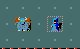</td>
			<td>
				

					I've been picking up some loose coins in case I encounter
					any more arch-daemons, and indeed I find Orcus lurking in the abandoned
					town within Gehennom.  I approach him with a hand on my pocketbook, ready
					to offer him all that I have collected, when he fires a death bolt at me.
				

			</td>
		</tr>
		</table>
		

			All over the town, Orcus and I trade barbs.  Whenever I close in
			with Magicbane, he teleports away.  He often summons a collection
			of helpers to keep my busy, but they fall either to my death beams
			or Orcus'.  I use my telepathy to determine that Orcus guards the
			staircase to the upper levels when he's not engaged with me, so I
			head in that direction to confront him there.
		

		

			We fight on and around the stairs, until eventually I gain the upper hand
			and unleash a flurry of blows with Magicbane.  His wand empty and his ability
			to summon depleted, he is reduced to a defensive posture.  A troll that he summoned
			continues to pound on my back and head, but I ignore the troll and finally
			deal a death blow to Orcus.  I shiver runs through me and I begin to fear my
			own power.  I have bested an arch-daemon, might I be able to best a God?  I don't know
			what awaits me below, but I no longer fear it.  I fear what I might become instead.
			I fear that Anhur or another might smite me out of self-protection if my power increases much more.
		

	</td>
	<td>
		

			I've always liked this level.  You can usually find one or two significant items in
			the abandoned stores, and if you can get down here, you can easily handle the mimics.
		

	</td>
</tr>
<tr>
	<td>
		

			40 levels beneath the entrance, my mapping reveals a tower within the maze
			that encompasses several levels.  I am unable to get inside though, even using my
			pick-axe or a wand of digging.  I don't want to invite too much attention to
			myself my loitering, so I continue to move downwards.
		

		

			Deep within the maze, 46 levels beneath the entrance,
			my magic map reveals a level with no staircase down and I sense that I have
			emerged at the lowest depths of Gehennom.  I look all over though and find no
			signs of the Amulet I seek.  Could it all have been a trick?
		

		

			With little else to do, I retrace my steps all over the deepest level
			and again turn up nothing.  I feel a strange vibration in one specific spot
			within the maze, but digging there I find nothing.  I dig out the walls
			around the spot and again come up empty.  No Amulet.  No creatures.  Nothing.
		

	</td>
	<td>
		

			This inner tower confuses a lot of people because it's absolutely impossible to get
			inside when you first encounter it.  Just keep heading down and you'll come across the
			answer sooner or later.
		

	</td>
</tr>
<tr>
	<td>
		

			I head back up more cautiously than I descended, no longer in a rush for my goal is now unclear.
			I pass the five levels with interior towers that I cannot enter.  To be honest, I only tried to enter the
			towers on the first two levels that I encountered them.  They are large, and I'd rather not try my pickaxe
			at every inch of the wall until I've exhausted all other options.
		

		

			Soon after I pass the ghost town, I find what I've been looking for.  In my excitement to race to the stairs
			leading down, I'd shot right past an extra up staircase.  When I ascend, I feel as though I'm no longer in
			hell.  Things here aren't nearly as hot and an eiry silence replaces the screams of torment.  I'm in a small
			tower with small chambers, almost closets, along each wall.  I explore it all and while I find many creatures
			that wish to end me, none deliver much more than a scratch.   In a locked chest, I find an amulet of life
			saving.  I guess that you can never have too many of them.  Of course, now the only item that I've wished for
			that I haven't subsequently found is my bag of holding.  Better to be blessed with gifts than in need I
			imagine.
		

		<table class="innertable">
		<tr>
			<td>
				

					As I climb the tower, I begin to notice that I am facing more and more vampires and vampire lords.  They
					come so quickly and in such numbers that I cannot even be sure if I am killing them or if they are simply
					rising renewed to face me.  I push onward and emerge at the top of the tower.  Here I face Vlad the Impaler,
					the legendary first known vampire.  Vlad is a powerful foe, but an aged one and he falls to magicbane just
					like all the others.  His body disintigrates as I smite him and I'm certain
					that I won't have to face him again though a creature as powerful as him will likely
					find a way to return to this world in the future.
				

			</td>
			<td style="width:25%">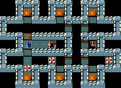</td>
		</tr>
		</table>
		

			Vlad had only one posession, and it wasn't the Amulet.  Instead he had a candelabrum which my identify spell
			revealed to be the Candelabrum of Invocation.  Fascinating.  I try to stuff the Candelabrum into my bag, but
			it refuses to enter, much like the Bell of Opening did before.  After some additional inspection, I notice
			that the Candelabrum can hold up to seven candles and I think back to Izchak in the lighting store.  I let out
			a sign and begin the long trip back to minetown.  I could wish for candles using the remaining charge in
			my wand of wishing, but that seems wasteful.  Also, I hold out hope that Izchak will provide me with
			additional guidance.
		

	</td>
	<td>
		

			In early versions of NetHack, the Amulet of Yendor was actually right there in the bottom of the dungeon.
			No such luck now however.
		

	</td>
</tr>
<tr>
	<td>
		

			On the way back to minetown, I somehow lose the ability to cast identify.  I just can't seem to recall
			the spell and become confused whenever I attempt the enchantment.  Of course, I've left my spellbooks
			behind in my camp, to maximize my capacity for new items.  I don't mind so much, as I'm covering ground
			that I've already been over and don't expect to find much.
		

		

			Tracing my steps backwards, I cast magic mapping on most of the levels to make sure that I didn't miss
			anything the first time around.  Several times I see small enclosed vaults which are unreachable without
			digging.  I dig to a couple to see if there is anything exciting within, but there is only gold.  Huge
			amounts of gold, but still just gold nonetheless.
		

		

			As I stoop to collect some of the treasure to deposit in my camp, I am magically teleported to the entrance
			of a giant fort.  Tons of human soldiers guard the entrance, along with an assortment of beasts.  This is
			nothing I haven't handled before though, and I find that sending death beam after death beam through an
			open doorway is not an attack strategy they are prepared to defend against.  I allow Magicbane to clean up
			whatever remains and soon circle the inner fort, looking for an entrance.
		

		

			On the eastern end, I find a door which I knock down with a wand of striking.  Inside, the throne room
			is packed with dragons and a lord named Croesus.  A white dragon hits me with a frost beam, but I am unhurt.
			Thankfully though, the beam freezes the moat and I rush across before it melts.  Soon, the throne room
			contains only myself and an assortment of meats.  Of course, a pile of troll meat gets up and regenerates
			to renew the fight.  I touch him with my finger of death and move into the inner chamber.
		

		<table class="innertable">
		<tr>
			<td style="width:25%">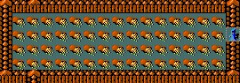</td>
			<td>
				

					Painstakingly, I count up all the gold pieces in the treasure chamber.  47,238 in total.  I decide to lug
					this along.  So long as I came through here and did so much work, I might as well leave with the treasure.
					It's heavy, and I have that same troll beating me over the head as I leave, but I'm happy with the result.
				

			</td>
		</tr>
		</table>
		

			This is more gold than I've encountered thus far, combined.  I cut the troll down again with Magicbane,
			then close and lock the door to the treasure chamber, glad to be rid of him.
		

		

			Sifting through the corpses in the throne room, I find a potion of gain level.  I'd like to drink it, but
			it might be cursed and I cannot cast identify any more.  Before I can determine the enchantment on the
			potion, I step into a fire trap and it boils and explodes.  I'd rather have drunk it cursed than see
			it destroyed.  Either way, my neglecting to bring my spellbooks along has cost me already.
		

	</td>
	<td>
		

			This special level is called Fort Ludios.  It is not always present in the NetHack dungeon, but worth
			entering if you encounter it.
		

		 
		

			If you drink a cursed potion of gain level, you will simply rise through the ceiling to the next highest
			level in the dungeon.  I'm not sure what exactly would happen on a special level like Fort Ludius though,
			as technically there are no levels either above or below it.
		

	</td>
</tr>
<tr>
	<td>
		

			I complete my journey back to minetown without any other significant encounters and arrive in Izchak's shop.
			He smiles and we explain pleasantries, but he offers me no additional guidance.  I ask why he didn't offer
			me the candles before and he muttered something about not liking to give candles to every seeker that
			zips through his store.  "If I did that, I wouldn't have had any candles left for you!"  I buy 7 candles
			and insert them into the Candelabrum.  Nothing happens.
		

		

			I stop at my basecamp on the return trip to Gehennom.  There I grab all of the spellbooks that I rely on
			and reread the books carefully to refresh my memory.  Unfortunately, many of them have faded and the
			writing is too faint for me to read.  These books are no more valuable than blank paper.  Perhaps the
			overuse of my wand of polymorph has produced books of poor quality.  I am happy to have learned the spells
			in the first place, but feel lacking now that I realize many of them are lost to me.  I still know finger
			of death though as well as magic mapping.  Right now, there's no pair of spells I'd rather have.  My wand
			of wishing still has one charge left it in as well, and I have my magic lantern.  I save them both for now
			but feel comfort from being but a wish away from whatever I desire.
		

		

			Somewhere around Asmodeus' chambers I encounter a creature known as a disenchanter.  I smack him repeatedly
			with Magicbane and he falls.  Unfortunately though, I notice that Magicbane itself seems wounded from the
			encounter, and closer inspection reveals that it is now +1 instead of +2.  I curse myself for erasing my
			cache of enchant weapon scrolls.  I had thought I wouldn't need them again.I'm thankful that the
			disenchanter didn't do more damage to the items I'd worked so hard to improve.
		

	</td>
	<td>
		

			Each spellbook can only be read three times, regardless of whether you polymorph it or not.  In addition
			each spell that you learn will only be remembered for 20,000 turns.  To this point in the game, I've
			played about 60,000 turns, which is on the high side for an experienced player.  I attribute this to my
			overly cautious playstyle, especially in the ealier dungeon levels.
		

	</td>
</tr>
<tr>
	<td>
		

			I return to the levels with the impenetrable towers.  I've already mapped their insides using my mapping
			spell.  This time, I start at the bottom and work my way up.  The lower towers are smaller and though they
			are surrounded by water, I can easily levitate over that.
		

		

			The first one I easily penetrate with my pick-axe and I feel foolish for not attempting this earlier.
			Inside I find an amulet and feel more foolish.  I suspect that it can't be this easy though, and I'm fortunate
			to have recently picked up a scroll of identify.  This is an amulet of strangulation and I leave it where
			I found it.  Perhaps if I fail to recover the Amuler of Yendor, I shall return here for this amulet instead
			of returning to my village a failure.
		

		

			The walls of the next inner tower fall to my pickaxe, and the enemies inside soon after to my blade.
			I don't see anything inside, but while searching I trigger a magical transporter and soon find myself within
			the walls of the larger towers above me.  My heartbeat quickens and I begin exploring the inner chambers.  I open
			one door and stare into hundreds of eyes.  A cockatrice hisses and is the first through the doorway.  I fear
			these bird-beasts, for they have the power to turn flesh to stone.  I know the spell to reverse the effect
			but am not skilled enough to cast it reliably.  Normally I dispatch these creatures from a distance, but I
			wasn't aware of what laid on the other side until I had opened the door.  A more careful wizard would have
			used his telepathy and not faced this situation.
		

		

			My reflexes take over before I can complete my thought process and the cockatrice falls to a death bolt.  My
			flesh protected by my gauntlets of dexterity, I pick up the corpse and wade into the hoard of creatures.  I
			swing the corpse widely and my foes slow down and become statues.  Dragons, vampires, insects and more.  All
			petrified by my makeshift weapon.  A lowly lizard remains and though I hit him with the cockatrice corpse
			repeatedly, he remains unharmed and mobile.  Finally I simply beat him to death using the corpse as a cudgel.
		

		

			Rotting and flayed, the corpse is no longer useful to me, so I toss it aside. and move to the next chamber
		

	</td>
	<td>
		

			This technique is known as the "rubber chicken" within NetHack circles.  Cockatrices and their corpses are
			very dangerous items and should not be used recklessly.  There are many ways to petrify yourself even if you
			wear gloves while attacking with this weapon.  Of course, there are several very powerful creatures that are
			immune and the corpse won't last forever either.  This technique is best used in the circumstances I describe
			here.
		

		 
		

			It turns out that you can reverse the petrification from a cockatrice in a couple of different ways.  Eating
			a lizard corpse will always work, and lizard corpses do not decompose to make that technique easier.  Experienced
			players will usually carry the first lizard they kill around with them just in case.  More experienced players
			never let a cockatrice get close enough to touch them.
		

	</td>
</tr>
<tr>
	<td>
		<table class="innertable">
		<tr>
			<td>
				

					I continue to climb and am soon at the top level of the inner towers.  Telepathy reveals the Wizard of
					Yendor hiding within a moat-encircled chamber.  I levitate and dig through with my pickaxe.  He summons
					friends to help him just as my death bolt hits him squarely in the chest.  Sensing that victory is at
					hand, I let loose a continuing stream of death bolts to finish off those that he summoned.  Picking through
					his remains though, I don't find any amulets.  Instead he has an ancient papyrus book.  Like the Bell and
					Candelabrum before it, it refuses to enter my bag.  What a wonderful collection of stubborn items I seem
					to have attained.
				

			</td>
			<td style="width:25%">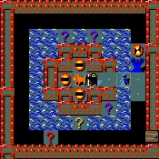</td>
		</tr>
		</table>
		

			The Wizard of Yendor is older and more powerful than any other on record, and I find it difficult to believe
			that I, even as powerful as I am, was able to defeat him so easily.  Perhaps this was an imposter, or perhaps
			he underestimated me.  I search my memories and cannot find any part of the dungeon that I have yet to
			explore.  I'm puzzled, but feel stangely drawn towards the bottom of Gehennom again and I gather my items
			and descend for what I hope will be the final time.
		

	</td>
	<td>
		

			While I had what I consider to be "bad luck" early in this game, I find that ever since I entered my quest
			I've been having fairly "good luck."  Having the wizard fall this easily bodes well for my future, but
			in now way ensures any particular outcome.
		

	</td>
</tr>
<tr>
	<td>
		<a name="amulet"><h1>The Amulet of Yendor</h1></a>
		

			So here I am again.  The bowels of hell, quite literally.  Perhaps Juiblex's insides were more disgusting, but
			this is a close second I believe.  In my hurry to descend before, I perhaps failed to notice the stench.  I noticed
			the quantity, but not the vile nature of the creatures.  A vileness that increased to unimaginable levels
			as I came closer and closer to the center of the world.
		

		

			I stand at the strange vibration I detected earlier.  It has not moved.  I pray to Anhur and he blesses
			me.  I had hoped for more.
		

		<table class="innertable">
		<tr>
			<td style="width:25%">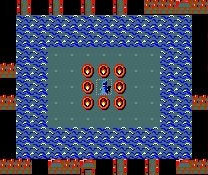</td>
			<td>
				

					I ring the Bell of Opening, hoping for a miracle.  Its loud tone resounds through the mazelike corridors.
					The vibration seems to increase and I am hopeful, though confused.  Knowing that the Candelabrum and Papyrus
					Book are related somehow, I light the candles and turn through the pages of the book.
				

				

					The Wizard's book turns out to be the Book of the Dead, and as I read from its pages, a huge rumbling can
					be heard and I am cast to the ground.  Walls melt and a ring of fire surrounds me.  When the smoke and steam
					clear, I can see that I stand on an island within the maze.  Surrounded by water and inside a furiously
					burning circle.  The vibration is gone, but a strange staircase leading downward into the mist is beside
					me, beckoning.
				

			</td>
		</tr>
		</table>
	</td>
	<td>
		

			This ritual begins the endgame in NetHack.  You can light the candles and ring the bell in any order, but
			you must read from the book as the last step.  After you do this, you can discard these items though they
			have great value in terms of your score if you complete the game with them in your possession.
		

	</td>
</tr>
<tr>
	<td>
		

			I descend and the final onslaught begins.  I cut down a wall of enemies to reveal a
			familiar face on the other side.  Somehow the Wizard of Yendor had returned to continue
			the fight.  He summons a large complement of allies and I let fly with my death beams.
			Unfortunately, there was a troll in the Wizard's entourage, and I'm unable to shake him loose.
			He falls to Magicbane time and time again, only to rise inconviently as I attempt to
			move deeper within the inner sanctum I've entered.  Finally I take off my ring of slow
			digestion and eat the troll before he can regenerate.  It's unpleasent, but after my
			experience inside Juiblex, I feel that there is very little I won't be able to eat
			for the rest of my life.
		

		

			I follow a series of corridors which open up into a large cavern with a temple in the middle.
			Priests of moloch are everywhere, and they command their minions to attack.  At first, I'm able
			to stave the assault with my death beams, but then one priest steps in to lead the charge
			and he's protected by a cloak of magic protection like mine.  He summons huge swarms of insects
			and I can't get close enough to him to strike out with Magicbane.
		

		

			As the battle stretches on, the priest begins to run out of magical energy and I'm able to
			cut my way through his summoned insects so that we might exchange pleasentries.  I introduce
			myself and he responds with a vicous flurry of kicks and punches.  Taken aback by his strength
			I close in again and introduce him to my friend and companion .  "... but you may refer to him as
			Mr. Bane."
		

		

			I have no time to celebrate my victory though as our battle in tight quarters has done
			nothing but slow the larger assault.  A cockatrice hisses and attacks, and I strike it
			down.  I know that I could end this conflict much faster if I were able to use his corpse
			like a weapon as I did before, but my enemies trample the corpse in an effort to do harm to
			me and I can't get a firm grip.  I instead rip the cloak of magic protection from the corpse
			of the priest and step back into the hallway.  I don't want any of the priests friends to
			be able to use this cloak for themselves.
		

		

			Finally the dust settles and I am temporarily alone.  I can hear sounds coming from all
			over the chamber, but nothing can threaten me unless it arrives in large numbers, so I'm not
			worried.  I'm not particularly interested in items, but I take a look at the bodies I've
			piled up to see if anything might still benefit me.  I wipe blood off a single scroll of
			charging and approach the central chamber.
		

	</td>
	<td>
		

			Never underestimate the Wizard of Yendor.  He has many tricks up his sleeves.  Whenever
			you see him, kill him as quickly as you can.
		

		 
		

			The Wizard's two nastiest tricks are stealing important items from you (like the Amulet,
			your quest artifact, etc...) and cursing your items.
		

	</td>
</tr>
<tr>
	<td>
		

			I can see no entrance to the chamber and as I approach it to search for a secret door flames
			shoot up all around me and burn up the scroll of charging I'd just found.  My bag of holding
			protects my other items and I wish that I had put the scroll in there when I had the chance.
			I have nothing else to lose though, so I slowly begin the process of searching and eventually
			find the entrance.
		

		

			I enter the temple and see the high priest of Moloch within.  He eyes me warily and we
			square off, circling each other.  I strike first with magicbane and all hell breaks loose.
		

		

			Moloch's voice booms throughout the chamber and the priest summons an insect swarm to keep
			me busy.  I fire death bolts at the insects and strike again with Magicbane.  This time
			lightning strikes me and Moloch again warns me against attacking his follower.  I pray to
			Anhur for help, and a laugh fills the temple.  "Fool, your God cannot help you here!"  The
			high priest pounces with a flurry of bloes but I gain the upper hand and split his ribs
			with Magicbane.  I look through his spellbooks and don't see anything that's new to me.
			He has an ornate amulet around his neck, and I pick it up.
		

		

			A cold shiver runs up my spine and a feeling of cold and dread overcomes me.  I sense that
			I have found my prize, but I have no way to be sure.  I simply must know though, so I use
			my final wish on a magic marker and rewrite a spellbook of identify.  My enchantment
			confirms that this is indeed the Amulet of Yendor.
		

		

			The dungeon is filled with noises, but not what I expected.  There is no rumbling as this
			pit of evil collapses.  There is no choir singing the praises of my victory.  There is only
			snarling and footsteps and clanking.  I drop everything I don't need and run.
		

	</td>
	<td>
		

			In this particular game, this battle was much harder than I remember it being.  Usually striking
			this guy down to get the amulet is fairly easy, and it's the stuff that comes later that's really
			hard.
		

	</td>
</tr>
<tr>
	<td colspan="2">
</td>
</tr>
<tr>
	<td>
		<a name="escape"><h1>The Great Escape</h1></a>
		

			I run like the wind, avoiding all but my fastest pursuers.  I wear my ring of levitation
			and it helps me to avoid traps and other pitfalls.  I slowly rise through Gehennom.  On a
			few occasions, I get a feeling of deja vu and sense that I'm somehow covering the sam
			ground over and over.  Since I'm moving so fast, and filled with such excitement I really
			can't say for sure.
		

		

			I make a wrong turn and accidently enter Vlad the Impaler's tower.  No foes await me
			within its walls though.  Taking off my ring, I drop to the floor and can retrace my
			steps to find the right path.
		

		

			Before I know it, I'm at the castle.  Soon after I'm well into the Dungeons of Doom and
			not long after, I arrive at the entrance to the dungeon itself.  I breath a sigh and
			think back to the time I entered with Oscar.  My companion never made it past this level,
			and forever here shall he lie.  I begin my final climb out of the dungeon and being my
			long trip home.
		

		

			The staircase leads me out of the dungeon, but not to the same location I entered.  I turn
			to return to the relative safety of the dungeon and realize that there is no way back.  A
			familiar face beckons, but I doubt he will help to explain my current situation.
		

		

			I'm trapped in a tiny chamber with the Wizard of Yendor himself and he launches another attack.
			I strike him, and he shivers and splits in two.  I am surprised and unprepared for the conflict.  I turn to flee,
			but I cannot go back the way I came.  I manage to trike down one Wizard with death bolts, just as a hoard
			of creatures pours into the chamber through a hole created by an Umber hulk.  I unleash all that I have
			and while I can kill most of my foes, the Wizard remains, and an archon is resistant to my magical attacks.
		

		

			The first fatal blow was struck by the Archon.  He seemed easily as powerful as I was.  Instead of darkness though,
			I was met by light as my Amulet of Life Saving preserved and restored me.  The second fatal blow came from the Wizard
			himself, and I could feel his fingers tugging the Amulet of Yendor from my posession as I exhaled my last breaths.
			I felt as though I had let down my God.  I felt as though my foolishness had somehow cost me not only my mortal
			life, but also a chance at immortality.  A thousand mistakes flew through my mind, and then I felt nothing.
		

		

			Does that suck or what?  An experienced player entering the "Elemental Plane of Earth" where I died wins the game about
			9 times out of 10 or more.  What can I say except that I let you guys down and now you'll have to play for yourself to
			see what happens.  I could have cheated and restored from a saved game I copied (I did that so I could replay certain
			sections to take "representative" screen shots instead of taking them all as I went along), but that would have been
			lame.  Hope everyone enjoys my first (and presumably last) battle report.  Much thanks to JV and the gang for all
			their work over the years keeping things going!
		

	</td>
	<td>
		

			It's odd.  The game has no "time" element to it in the sense that nothing happens while the game
			waits for you to make your next move.  Still, I find myself racing away from the scene of the crime.
		

	</td>
</tr>
</table>

